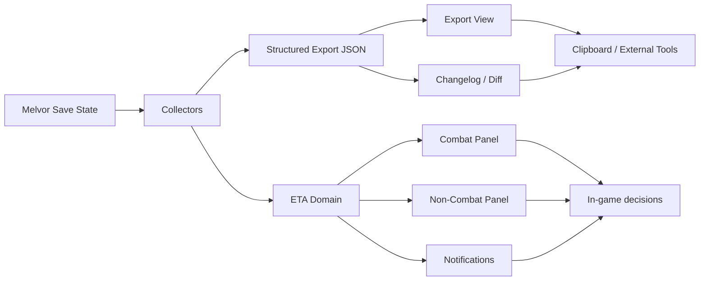

# CDE - Character Data Exporter for Melvor Idle

[](https://github.com/AlexAgo83/cde/tags)
[](https://github.com/AlexAgo83/cde/commits/main)
[](https://melvoridle.com/)
[](./validate.sh)

CDE is a Melvor Idle mod focused on two things:

- exporting a structured JSON snapshot of your character for analysis, automation, and tooling
- surfacing live ETA panels for combat and non-combat activities directly in-game

## Overview



## Features

- Structured character export with stable sections such as `basics`, `stats`, `bank`, `shop`, `currentActivity`, and optional activity-specific data
- Delta / changelog generation between the latest and previous export snapshots
- Live ETA panels on combat and non-combat pages
- Skill, mastery, recipe, combat, and action-duration projections
- Optional browser and shared notifications for ETA completion
- Compact or pretty-printed JSON output
- Persisted local and character-scoped state via local storage and cloud storage helpers
- Export-oriented workflow designed to be consumed by spreadsheets, scripts, or LLM tools
- Local release gate covering manifest consistency, tests, `logics`, packaging, and archive validation

## Installation

1. Build or download the archive.
The local packaging command produces an archive named like `cde-3_0_17.zip`.

2. Import the mod into Melvor Idle.
- Use the in-game mod manager / mod loader
- Or import the zip manually, depending on your platform setup

3. Enable the mod and reload the game.

## In-Game Capabilities

### Export

- Generate a full JSON export from the current character state
- Store the latest export locally
- Compare the current export against the previous one
- Keep a bounded changelog history

### ETA Panels

- Combat panel with kill-based metrics and combat timing
- Non-combat panel with next-level, mastery, recipe, and action projections
- Compact / expanded panel modes and persisted visibility / placement
- Runtime refresh via Melvor hook integration and guarded fallbacks

### Notifications

- Browser notification support when the platform allows it
- Shared / persisted pending notification state
- Auto-notify flows for ETA-enabled actions

## Configuration

The in-game settings currently cover:

- export formatting and persistence
- changelog retention
- ETA display toggles
- combat metrics and live DPS
- level and mastery prediction
- browser / shared / auto notifications
- global-event based ETA refresh tuning
- debug mode for runtime diagnostics

## Export Shape

The exported JSON is centered around a few stable roots:

- `basics`: character identity, currencies, core metadata
- `stats`: tracked counters and progression state
- `bank`, `shop`, `pets`, `relics`, `cartography`, and other unlocked content sections when enabled
- `currentActivity`: live combat or skill activity snapshot
- `activePotions`: currently active potion state when available
- `meta`: mod version and export metadata

## Development

### Build

```bash
bash build.sh
```

### Full Validation

```bash
bash validate.sh
```

This runs:

- manifest validation
- Python tests
- Node tests
- `logics` lint
- workflow audit
- packaging
- release gate checks

## Repository Status

The README is aligned with the current codebase for:

- single-source versioning from [`setup.mjs`](./setup.mjs), re-exported through [`modules/version.mjs`](./modules/version.mjs)
- local packaging via [`build.sh`](./build.sh)
- full validation via [`validate.sh`](./validate.sh)
- active ETA panels, notifications, changelog support, and export flow

## License

No root `LICENSE` file is currently present in the repository.
