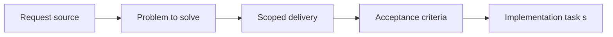

## item_002_improve_testability_testing_and_ci_hardening - Improve testability, testing, and CI hardening
> From version: 2.1.227
> Status: Done
> Understanding: 95%
> Confidence: 96%
> Progress: 100%
> Complexity: Medium
> Theme: Reliability
> Reminder: Update status/understanding/confidence/progress and linked task references when you edit this doc.

# Problem
- The project remains difficult to validate automatically because business logic, runtime integration, and UI/event orchestration are tightly coupled.
- Most regressions currently require manual in-game verification, which raises the cost and risk of changing export generation, ETA logic, settings/storage behavior, and packaging.
- Without a minimal test and CI safety net, future stabilization or architecture work will remain fragile.

# Scope
- In:
- Define an incremental path to improve testability without forcing a full rewrite.
- Identify and extract priority pure-logic seams worth validating first, especially in export logic, diff/history behavior, selected ETA calculations, and manifest/package coherence.
- Add or document a lightweight automated validation path that can run outside the live game runtime.
- Frame lifecycle contracts, runtime coupling, and type-safety opportunities as explicit follow-up review concerns.
- Out:
- Full rewrite of all modules
- Mandatory TypeScript migration of the entire codebase
- Broad feature work unrelated to validation, testability, or CI hardening

# Acceptance criteria
- AC1: A clear incremental strategy exists for improving testability without requiring a full rewrite.
- AC2: Priority areas for extraction and validation are identified, including export logic, diff/history behavior, selected ETA calculations, and manifest/package coherence.
- AC3: A lightweight automated validation path is defined or implemented, including at least packaging coherence checks and a path for future test execution in CI.
- AC4: Runtime coupling and lifecycle assumptions are explicitly captured as concerns to reduce progressively, not ignored.
- AC5: Type-safety and long-session UI/runtime stability are recorded as secondary review tracks for later breakdown.

# AC Traceability
- AC1 -> incremental testability plan exists. Proof: backlog/task breakdown or validation notes.
- AC2 -> priority extraction candidates are named and scoped. Proof: backlog/task breakdown or notes.
- AC3 -> automated validation path is available or documented. Proof: command/config/docs links.
- AC4 -> runtime coupling/lifecycle concerns are documented in delivery artifacts. Proof: notes or task links.
- AC5 -> secondary review tracks are preserved for later execution. Proof: notes or follow-up task links.

# Links
- Request: `req_003_improve_testability_testing_and_ci_hardening`
- Primary task(s): `task_001_improve_testability_testing_and_ci_hardening`

# Priority
- Impact: P1. This is the main leverage item for making the project safer to evolve after immediate stabilization.
- Urgency: Start right after `item_000_stabilize_mod_loading_packaging_and_export_consistency`; it should precede any serious rewrite preparation.

# Notes
- Derived from request `req_003_improve_testability_testing_and_ci_hardening`.
- Source file: `logics/request/req_003_improve_testability_testing_and_ci_hardening.md`.
- Recommended execution order: 2 of 4.
- Dependency: `item_000_stabilize_mod_loading_packaging_and_export_consistency`.
- This item is the main prerequisite for `item_003_prepare_a_clean_architecture_rewrite_after_stabilization`.
