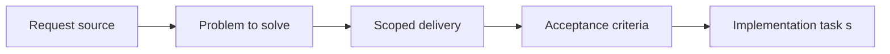

## item_004_extract_export_domain_logic_behind_runtime_adapters - Extract export domain logic behind runtime adapters
> From version: 3.0.0
> Status: Done
> Understanding: 94%
> Confidence: 96%
> Progress: 100%
> Complexity: Medium
> Theme: Architecture
> Reminder: Update status/understanding/confidence/progress and linked task references when you edit this doc.

# Problem
- Export bootstrap, diff, and history rules are still mixed with runtime and browser side effects.
- That coupling makes the most immediate rewrite slice harder to test and reason about.
- This item creates the first clean architecture seam while preserving the current export behavior and payload shape.

# Scope
- In:
- extract pure export-domain logic for bootstrap, diff, and history behavior
- keep storage, sharing, and UI side effects behind adapters or orchestration code
- validate the seam primarily through local tests and CI
- Out:
- redesigning the export schema
- rewriting the export UI
- changing collector, ETA, or page-injection behavior

# Acceptance criteria
- AC1: Export bootstrap, diff, and history rules are isolated as a dedicated migration slice behind runtime adapters or orchestration code.
- AC2: Existing export behavior and payload shape stay stable while the seam becomes testable through local validation and CI.
- AC3: Execution is tracked through the shared orchestration task with regular `logics` updates and commits.

# AC Traceability
- AC1 -> Problem and scope define the seam and the targeted responsibilities.
- AC2 -> Scope and acceptance criteria preserve behavior while moving confidence to local validation.
- AC3 -> Links and notes tie the item to the orchestration task.

# Links
- Request: `req_005_extract_export_domain_logic_behind_runtime_adapters`
- Primary task(s): `task_005_extract_export_domain_logic_behind_runtime_adapters`, `task_004_orchestrate_incremental_rewrite_execution_governance_and_validation`

# Priority
- Impact: P0. This is the first real rewrite slice and the most useful early seam.
- Urgency: Immediate. It should start before the other rewrite backlog items.

# Notes
- Derived from request `req_005_extract_export_domain_logic_behind_runtime_adapters`.
- Source file: `logics/request/req_005_extract_export_domain_logic_behind_runtime_adapters.md`.
- Execution order: 1 of 11 rewrite items.
- Dependencies: stabilized startup, validation path, and current roadmap governance.
- Delivery result:
- export bootstrap, diff, and history rules now flow through `modules/exportDomain.mjs`
- runtime-facing modules keep storage, viewer, and side-effect responsibilities
- local validation and CI coverage were extended with `tests/test_export_domain.mjs`
