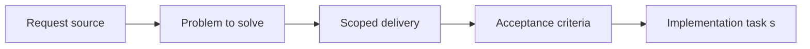

## item_005_extract_settings_domain_logic_behind_storage_adapters - Extract settings domain logic behind storage adapters
> From version: 3.0.0
> Status: Done
> Understanding: 94%
> Confidence: 96%
> Progress: 100%
> Complexity: Medium
> Theme: Architecture
> Reminder: Update status/understanding/confidence/progress and linked task references when you edit this doc.

# Problem
- Settings rules are still distributed across defaults, storage loading, normalization, and feature-specific interpretation.
- That makes runtime behavior harder to audit and increases drift risk between stored values, displayed options, and effective behavior.
- This item turns settings handling into the second explicit domain seam after export.

# Scope
- In:
- extract defaults, normalization, validation, and interpretation into a settings-domain layer
- keep storage and UI-specific behavior behind adapters or orchestration
- validate behavior primarily through local tests and CI
- Out:
- redesigning the settings UI
- rewriting all storage code in one pass
- changing ETA or collector behavior

# Acceptance criteria
- AC1: Settings defaults, normalization, and interpretation are defined as a dedicated migration slice behind storage adapters.
- AC2: Visible settings behavior remains stable while settings logic becomes testable outside the live game runtime.
- AC3: Progress stays coordinated through the shared orchestration task with regular `logics` updates and commits.

# AC Traceability
- AC1 -> Problem and scope define the extracted settings responsibilities.
- AC2 -> Scope and acceptance criteria preserve visible behavior while improving validation.
- AC3 -> Links and notes keep execution tied to the orchestration task.

# Links
- Request: `req_006_extract_settings_domain_logic_behind_storage_adapters`
- Primary task(s): `task_006_extract_settings_domain_logic_behind_storage_adapters`, `task_004_orchestrate_incremental_rewrite_execution_governance_and_validation`

# Priority
- Impact: P1. Settings become a high-leverage shared seam for later slices.
- Urgency: High. This should follow the export seam.

# Notes
- Derived from request `req_006_extract_settings_domain_logic_behind_storage_adapters`.
- Source file: `logics/request/req_006_extract_settings_domain_logic_behind_storage_adapters.md`.
- Execution order: 2 of 11 rewrite items.
- Dependencies: `item_004_extract_export_domain_logic_behind_runtime_adapters`.
- Delivery result:
- settings defaults, normalization, serialization, and persisted-value application now flow through `modules/settingsDomain.mjs`
- runtime-facing modules keep storage access and UI-specific behavior outside the seam
- local validation and CI coverage were extended with `tests/test_settings_domain.mjs`
