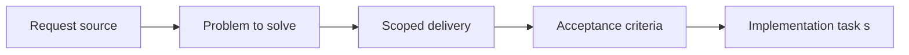

## item_010_isolate_collector_logic_behind_runtime_collection_adapters - Isolate collector logic behind runtime collection adapters
> From version: 3.0.0
> Status: Done
> Understanding: 97%
> Confidence: 97%
> Progress: 100%
> Complexity: High
> Theme: Architecture
> Reminder: Update status/understanding/confidence/progress and linked task references when you edit this doc.

# Problem
- Collector logic remains the most runtime-coupled part of the project.
- If it is tackled too early, it can destabilize the rewrite before architecture boundaries are mature enough.
- This item isolates collectors only after the earlier seams make the runtime boundary safer to address.

# Scope
- In:
- isolate collector aggregation rules from raw runtime collection access
- preserve export schema expectations and data coverage while reducing coupling
- validate migrated collector behavior through fixtures, controlled inputs, or equivalent local checks
- Out:
- rewriting every collector path in one shot
- redesigning export schema content
- unrelated UI or ETA changes

# Acceptance criteria
- AC1: A later-stage collector isolation slice is defined around separating runtime collection adapters from aggregation rules.
- AC2: Export schema expectations and collector coverage stay stable while runtime coupling is reduced.
- AC3: The item remains sequenced through the orchestration task and gated behind earlier architecture slices.

# AC Traceability
- AC1 -> Scope defines the collector boundary and the later-stage nature of the slice.
- AC2 -> Acceptance criteria preserve data coverage while enabling safer validation.
- AC3 -> Notes and links make the sequencing dependency explicit.

# Links
- Request: `req_011_isolate_collector_logic_behind_runtime_collection_adapters`
- Primary task(s): `task_013_define_collector_adapter_fixtures_and_boundaries`, `task_014_extract_collector_aggregation_behind_collection_adapters`, `task_004_orchestrate_incremental_rewrite_execution_governance_and_validation`

# Priority
- Impact: P3. Collector isolation is strategically important but should happen late.
- Urgency: Low-medium. It should wait until the earlier architecture seams are materially in place.

# Notes
- Derived from request `req_011_isolate_collector_logic_behind_runtime_collection_adapters`.
- Source file: `logics/request/req_011_isolate_collector_logic_behind_runtime_collection_adapters.md`.
- Execution order: 7 of 11 rewrite items.
- Dependencies: `item_004` through `item_009` materially in place.
- Execution slices:
- define fixtures and adapter boundaries first
- extract aggregation logic second
- Current delivery state:
- collector export boundaries and fixture-backed adapter validation are implemented and locally validated through `task_013_define_collector_adapter_fixtures_and_boundaries`
- selected collector aggregation rules are extracted into `modules/collectorDomain.mjs` and locally validated through `task_014_extract_collector_aggregation_behind_collection_adapters`
