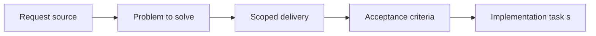

## item_013_remove_legacy_paths_and_align_the_repository_to_architecture_layers - Remove legacy paths and align the repository to architecture layers
> From version: 3.0.0
> Status: Ready
> Understanding: 91%
> Confidence: 93%
> Progress: 0%
> Complexity: Medium
> Theme: Architecture
> Reminder: Update status/understanding/confidence/progress and linked task references when you edit this doc.

# Problem
- Incremental migration will leave transitional code and redundant paths behind unless cleanup is planned explicitly.
- That would keep the repository noisier than needed and weaken the benefit of the new architecture.
- This item removes obsolete paths and aligns the repository with the architecture that has already been adopted.

# Scope
- In:
- remove redundant legacy paths and transitional wrappers when they are no longer needed
- align repository structure with the architecture layers established by earlier items
- validate that cleanup preserves the behaviors already stabilized by the roadmap
- Out:
- speculative redesign
- deleting still-needed compatibility paths prematurely
- unrelated feature work

# Acceptance criteria
- AC1: A cleanup slice is defined around removing obsolete legacy paths and aligning repository structure to the adopted layers.
- AC2: Cleanup preserves startup, export, settings, ETA, and UI behavior that earlier slices have stabilized.
- AC3: The item remains governed through the shared orchestration task and regular `logics` updates.

# AC Traceability
- AC1 -> Scope defines the cleanup target and its architectural purpose.
- AC2 -> Acceptance criteria preserve behavior while simplifying structure.
- AC3 -> Links and notes connect the item to the umbrella task.

# Links
- Request: `req_014_remove_legacy_paths_and_align_the_repository_to_architecture_layers`
- Primary task(s): `task_019_remove_legacy_paths_and_align_the_repository_to_architecture_layers`, `task_004_orchestrate_incremental_rewrite_execution_governance_and_validation`

# Priority
- Impact: P3. Cleanup becomes most valuable once the real structure is in place.
- Urgency: Low-medium. It should wait until the major migration slices and contract work are materially done.

# Notes
- Derived from request `req_014_remove_legacy_paths_and_align_the_repository_to_architecture_layers`.
- Source file: `logics/request/req_014_remove_legacy_paths_and_align_the_repository_to_architecture_layers.md`.
- Execution order: 10 of 11 rewrite items.
- Dependencies: `item_004` through `item_012` materially in place.
