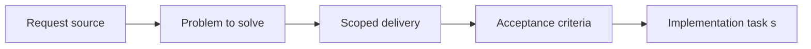

## item_014_harden_release_gating_packaging_and_runtime_validation - Harden release gating packaging and runtime validation
> From version: 3.0.0
> Status: Done
> Understanding: 100%
> Confidence: 97%
> Progress: 100%
> Complexity: Medium
> Theme: Reliability
> Reminder: Update status/understanding/confidence/progress and linked task references when you edit this doc.

# Problem
- The rewrite can still regress startup, packaging, exports, or UI integration if release confidence stays too light.
- Local validation and CI will carry most of the confidence load for much of the rewrite, so the release gate itself must mature.
- This item hardens release discipline once the architecture work is far enough along to justify a stronger gate.

# Scope
- In:
- strengthen packaging, startup, and core-flow release checks
- define a stronger minimal release gate built on local validation, CI, and focused runtime scenarios
- preserve current feature behavior while reducing regression risk
- Out:
- feature redesign
- heavy process that does not materially improve confidence
- replacing earlier test and CI work instead of building on it

# Acceptance criteria
- AC1: A release-hardening slice is defined around packaging, startup, core-flow validation, and runtime-sensitive checks.
- AC2: The project gains a stronger minimal release gate without changing product behavior for its own sake.
- AC3: The item remains sequenced through the shared orchestration task and later-stage roadmap execution.

# AC Traceability
- AC1 -> Scope defines the release-gating target and validation surfaces.
- AC2 -> Acceptance criteria preserve product behavior while strengthening confidence.
- AC3 -> Notes and links keep the slice within the umbrella execution plan.

# Links
- Request: `req_015_harden_release_gating_packaging_and_runtime_validation`
- Primary task(s): `task_020_harden_release_gating_packaging_and_runtime_validation`, `task_004_orchestrate_incremental_rewrite_execution_governance_and_validation`

# Priority
- Impact: P2. Release confidence is essential once multiple migration slices have landed.
- Urgency: Late. This should follow most of the architecture and cleanup work.

# Notes
- Derived from request `req_015_harden_release_gating_packaging_and_runtime_validation`.
- Source file: `logics/request/req_015_harden_release_gating_packaging_and_runtime_validation.md`.
- Execution order: 11 of 11 rewrite items.
- Dependencies: `item_004` through `item_013` materially in place.
- Outcome:
- stronger release gate delivered through `task_020_harden_release_gating_packaging_and_runtime_validation`
- local and CI validation now run through a unified `validate.sh` gate
- packaging is constrained to runtime files and the produced archive is checked against `manifest.json`
