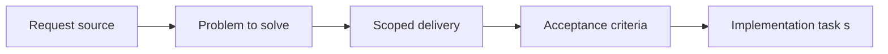

## item_017_harden_notification_adapter_state_transitions_and_test_coverage - Harden notification adapter state transitions and test coverage
> From version: 3.0.1
> Status: Done
> Understanding: 100%
> Confidence: 96%
> Progress: 100%
> Complexity: Medium
> Theme: Reliability
> Reminder: Update status/understanding/confidence/progress and linked task references when you edit this doc.

# Problem
- Notification behavior still depends on a runtime-heavy adapter with low direct coverage.
- Permission flow, builder persistence, shared-notification checks, and display payload generation are all easy to regress silently.
- This item hardens that adapter without redesigning notifications.

# Scope
- In:
- harden `modules/notification.mjs`
- clarify notification builder and permission state transitions where needed
- add direct tests for key branches without requiring live Melvor execution
- preserve current notification semantics
- Out:
- notification feature redesign
- UI redesign of notification panels
- changing shared-notification product behavior for its own sake

# Acceptance criteria
- AC1: The notification adapter is refactored only as needed to make critical state transitions clearer and more testable.
- AC2: Direct tests cover permission flow, builder lifecycle, shared-notification checks, and display payload generation.
- AC3: Current notification semantics remain unchanged.

# AC Traceability
- AC1 -> Scope defines a bounded adapter hardening slice.
- AC2 -> Acceptance criteria require direct notification tests.
- AC3 -> Scope preserves the current feature semantics.

# Links
- Request: `req_018_harden_notification_adapter_state_transitions_and_test_coverage`
- Primary task(s): `task_022_harden_notification_adapter_state_transitions_and_test_coverage`

# Priority
- Impact: P2. Notification regressions are user-visible and hard to detect manually without coverage.
- Urgency: Medium. It is a natural next post-roadmap hardening slice after local persistence.

# Notes
- Derived from request `req_018_harden_notification_adapter_state_transitions_and_test_coverage`.
- Source file: `logics/request/req_018_harden_notification_adapter_state_transitions_and_test_coverage.md`.
- Outcome:
- notification adapter hardened through `task_022_harden_notification_adapter_state_transitions_and_test_coverage`
- direct tests now cover builder normalization, permission flow, and display payload generation
- current semantics remain intact while storage compatibility now accepts both `playerName` and legacy `charName`
