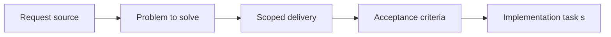

## item_023_fix_eta_level_prediction_labels_and_unknown_shared_notification_display - Fix ETA level prediction labels and unknown shared notification display
> From version: v3.0.17
> Status: Done
> Understanding: 95%
> Confidence: 95%
> Progress: 100%
> Complexity: Low
> Theme: UI
> Reminder: Update status/understanding/confidence/progress and linked task references when you edit this doc.

# Problem
- Non-combat ETA panels render prediction map keys directly, which can leak XP cap values into the UI (`to 104273167`) instead of target levels.
- Shared notification display can still include stale legacy entries under `Unknown`, creating noisy footer output.

# Scope
- In:
- Normalize prediction entries so ETA rendering has access to explicit `targetLevel` values.
- Update ETA rendering to prefer `targetLevel` over object key names.
- Add a defensive display-side filter for invalid shared notification owners such as `Unknown`.
- Add regression tests for ETA domain mapping and panel rendering.
- Out:
- Reworking ETA timing formulas.
- Changing notification scheduling semantics beyond invalid-entry filtering.

# Acceptance criteria
- AC1: ETA skill and mastery prediction rows show level numbers instead of XP cap values.
- AC2: Shared notification output no longer renders `Unknown` entries.
- AC3: Regression tests prove the corrected mapping and rendering behavior.

# AC Traceability
- AC1 -> [etaDomain.mjs](/Users/alexandreagostini/Documents/cde/modules/etaDomain.mjs), [eta.mjs](/Users/alexandreagostini/Documents/cde/modules/eta.mjs), [nonCombatPanel.mjs](/Users/alexandreagostini/Documents/cde/pages/nonCombatPanel.mjs). Proof: [test_eta_domain.mjs](/Users/alexandreagostini/Documents/cde/tests/test_eta_domain.mjs), [test_panels.mjs](/Users/alexandreagostini/Documents/cde/tests/test_panels.mjs).
- AC2 -> [notification.mjs](/Users/alexandreagostini/Documents/cde/modules/notification.mjs). Proof: [test_notification.mjs](/Users/alexandreagostini/Documents/cde/tests/test_notification.mjs).
- AC3 -> `node --test tests/test_eta_domain.mjs tests/test_panels.mjs tests/test_notification.mjs` and broader Node validation pass.

# Links
- Request: `req_024_fix_eta_level_prediction_labels_and_unknown_shared_notification_display`
- Primary task(s): `task_028_fix_eta_level_prediction_labels_and_unknown_shared_notification_display`

# Priority
- Impact: Medium. The bug is highly visible in ETA panels and undermines trust in the displayed progression data.
- Urgency: Medium. Functional ETA data exists, but the display regression is misleading and should not ship.

# Notes
- Derived from request `req_024_fix_eta_level_prediction_labels_and_unknown_shared_notification_display`.
- Source file: `logics/request/req_024_fix_eta_level_prediction_labels_and_unknown_shared_notification_display.md`.
