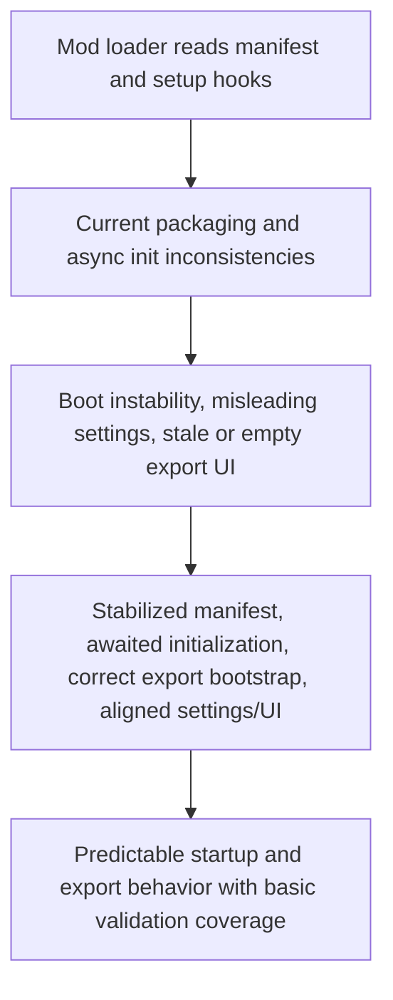

## req_001_stabilize_mod_loading_and_export_consistency - Stabilize mod loading, packaging, and export consistency
> From version: 2.1.227
> Status: Done
> Understanding: 94%
> Confidence: 97%
> Complexity: Medium
> Theme: Reliability
> Reminder: Update status/understanding/confidence and references when you edit this doc.

# Needs
- Fix the packaging and runtime initialization issues identified during the global project review.
- Prevent intermittent mod boot failures caused by manifest/runtime inconsistencies and async initialization races.
- Restore consistency between exposed settings, actual storage behavior, and the export UI state.
- Ensure the export modal and persisted export data behave predictably across sessions.

# Context
The current review identified four priority reliability issues:

1. `manifest.json` is inconsistent with the runtime module loading path.
The manifest references `libs/chart.mjs`, which does not exist in the repository, and does not list `modules/assetManager.mjs`, even though it is loaded during startup.

2. The startup flow is not fully awaited.
`setup.mjs` triggers `mModules.onModuleLoad(ctx, MOD_VERSION)` without awaiting it, while `modules.mjs` also triggers async submodule loading without awaiting completion. This creates a race with `onInterfaceReady`, which immediately dereferences viewer and page submodules.

3. Export cache bootstrap is incorrect.
`modules/export.mjs` initializes `exportData` with `{}` and only reloads persisted data when the value is `null`. As a result, opening the export UI without generating a new export in the current session can show an empty object instead of the last saved export.

4. Settings and UI behavior are partially misleading.
The `USE_LZSTRING` setting is exposed but not enforced by `modules/localStorage.mjs`, so compression is still used whenever the library is available. The export modal also uses `style.display = "visible"` for the diff button, which is not a valid `display` value.

Additional notes from the review:
- There is currently no automated validation path covering mod boot, manifest coherence, or export persistence behavior.
- The request should stay focused on stabilization and consistency, not on feature expansion.
- Documentation in `logics/` must stay in English per repository instructions.

# Acceptance criteria
- `manifest.json` references only existing module files required by the mod and includes modules loaded at runtime.
- The module and submodule initialization flow is awaited or otherwise synchronized so `onInterfaceReady` cannot consume unloaded viewer/pages submodules.
- Opening the export UI before any new export in the current session loads the last persisted export instead of `{}`.
- The `USE_LZSTRING` behavior is either implemented consistently in storage logic or removed from the exposed settings surface.
- The export modal uses valid CSS behavior for showing and hiding the diff button.
- A lightweight validation path is documented or added to check packaging coherence, startup initialization assumptions, and persisted export bootstrap behavior.
- The scope excludes redesigning ETA features, adding new gameplay collectors, or expanding export schema content.

# Definition of Ready (DoR)
- [x] Problem statement is explicit and user impact is clear.
- [x] Scope boundaries (in/out) are explicit.
- [x] Acceptance criteria are testable.
- [x] Dependencies and known risks are listed.

# Backlog
- None yet.
- `item_000_stabilize_mod_loading_packaging_and_export_consistency`

# Outcome
- Accepted as delivered.
- The remaining real-runtime Melvor verification was explicitly accepted by project decision, so the implemented stabilization work is considered complete.
