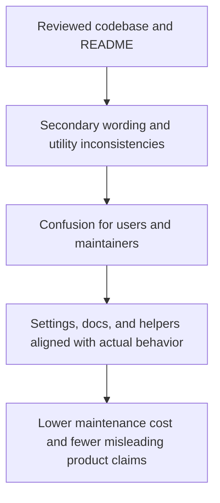

## req_002_align_documentation_and_secondary_api_consistency - Align documentation and secondary API consistency
> From version: 2.1.227
> Status: Draft
> Understanding: 94%
> Confidence: 95%
> Complexity: Low
> Theme: Documentation
> Reminder: Update status/understanding/confidence and references when you edit this doc.

# Needs
- Capture the secondary consistency issues found during the global review without mixing them into the primary stabilization request.
- Align public wording, exposed settings, and utility behavior so the mod surface matches what users and future maintainers expect.
- Reduce drift between README claims, settings labels, and actual implementation.

# Context
The first review request already covers the blocking reliability issues around manifest coherence, async initialization, persisted export bootstrap, and misleading settings behavior.

This follow-up request isolates the lower-severity inconsistencies that should be cleaned up after the primary stabilization work:

1. `EXPORT_COMPRESS` is described like an output compression feature, but the current implementation only switches between compact JSON and pretty-printed JSON for exported/shared content.
This creates ambiguity between "compact serialization" and actual compression. Actual UTF-16 / LZString compression is currently tied to local storage internals instead of the exported payload.

2. `getMasteryProgressPercent()` in `modules/utils.mjs` contains a reversed progress formula.
The function does not appear to be the main path used by the current UI, but it is still a latent bug in the shared utility surface and could produce negative or misleading values if reused later.

3. `README.md` currently advertises features that are not clearly backed by the implementation surface reviewed in this repository.
Examples include:
- custom export file naming
- export interval control
- auto-copy exports to clipboard
- summary generation for the last export

The objective of this request is not to add new features by default.
The objective is to either:
- implement the missing behaviors if they are intended and already partially designed, or
- reduce the public/documented surface so it truthfully reflects the shipped behavior.

# Acceptance criteria
- The meaning of `EXPORT_COMPRESS` is made explicit and consistent across setting labels, code behavior, and user-facing documentation.
- The utility function `getMasteryProgressPercent()` is either corrected or removed if it is intentionally unused.
- `README.md` is aligned with the actual implemented feature set, or the missing feature paths are explicitly tracked elsewhere instead of being advertised as shipped behavior.
- The scope remains limited to consistency, wording, utility correctness, and documentation alignment.
- The scope excludes redesigning the export UX, adding new ETA features, or introducing a broad documentation rewrite unrelated to reviewed discrepancies.

# Definition of Ready (DoR)
- [x] Problem statement is explicit and user impact is clear.
- [x] Scope boundaries (in/out) are explicit.
- [x] Acceptance criteria are testable.
- [x] Dependencies and known risks are listed.

# Backlog
- None yet.
- `item_001_align_documentation_and_secondary_api_consistency`
