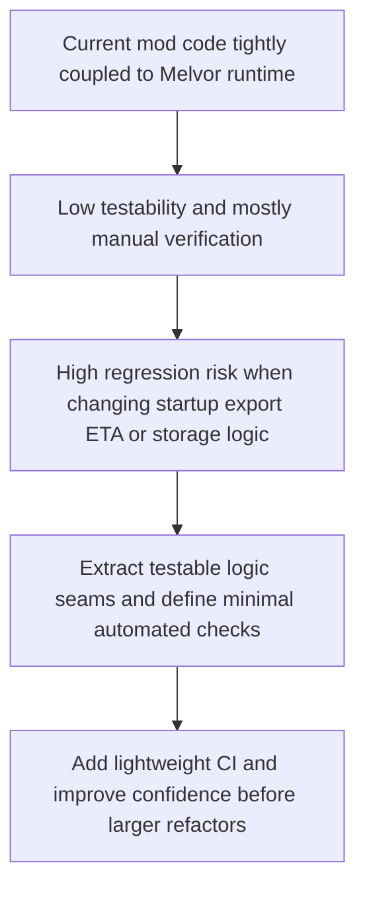

## req_003_improve_testability_testing_and_ci_hardening - Improve testability, testing, and CI hardening
> From version: 2.1.227
> Status: Draft
> Understanding: 94%
> Confidence: 95%
> Complexity: Medium
> Theme: Reliability
> Reminder: Update status/understanding/confidence and references when you edit this doc.

# Needs
- Capture the next review axis after the immediate stabilization work: make the project easier to validate, safer to evolve, and less dependent on manual in-game verification.
- Define a pragmatic path toward testability, automated tests, and lightweight CI without forcing a full rewrite up front.
- Reduce risk around regressions in export generation, ETA calculations, settings/storage behavior, and packaging.

# Context
The current project is a browser-game mod with direct coupling to runtime globals and environment services such as:
- `game`
- `ui`
- `Swal`
- `Notification`
- `localStorage`
- mod loader patch hooks via `ctx.patch(...)`

This coupling is visible across the codebase, especially in:
- `modules/collector.mjs`
- `modules/viewer.mjs`
- `modules/pages.mjs`
- `modules/notification.mjs`

That architecture is workable for shipping features quickly, but it currently makes automated validation difficult:

1. Business logic and runtime integration are mixed together.
This prevents simple unit testing for export generation, ETA logic, storage rules, and UI state transitions.

2. There is no clear automated validation path for the mod.
There is no visible project-level test harness, no CI workflow, and no basic automated checks for manifest coherence, packaging, or export bootstrap behavior.

3. Module lifecycle assumptions remain fragile.
Initialization order, runtime dependencies, and cross-module contracts are mostly implicit, which increases the chance of regressions when touching startup flow or view wiring.

4. Type safety is limited.
The codebase uses `// @ts-check`, but shared data contracts remain mostly informal and are not enforced through a stable typed model for export payloads, ETA objects, or settings references.

5. The UI/event layer is performance-sensitive.
`modules/pages.mjs` attaches observers and patches runtime events; this deserves explicit review for refresh rate, leak risk, and long-session stability.

This request is intentionally not a "rewrite the whole project" request.
The recommended direction is incremental:
- stabilize the current code
- extract the most valuable pure logic seams
- add tests where they pay off first
- introduce a minimal CI safety net
- re-evaluate later whether partial rewrites are justified

Potential first candidates for extraction and testing include:
- `modules/utils.mjs` pure helpers
- `modules/export.mjs` diff/history/bootstrap logic
- selected pure parts of `modules/eta.mjs`
- manifest/package coherence checks
- settings/storage bootstrap scenarios

# Acceptance criteria
- A clear incremental strategy is defined for improving testability without requiring a full rewrite of the mod.
- The request explicitly identifies priority areas for test extraction, including export logic, diff/history behavior, selected ETA calculations, and manifest/package coherence.
- The request defines the need for a lightweight automated validation path, including at least packaging coherence checks and future test execution in CI.
- The request explicitly frames runtime coupling and lifecycle contracts as a review concern to be addressed progressively.
- The request includes type-safety and long-session UI/runtime behavior as secondary review tracks, not as blockers for the first testing milestone.
- The scope excludes a blanket rewrite of all modules, a forced migration of the entire codebase to TypeScript, and a large-scale redesign of gameplay features.

# Definition of Ready (DoR)
- [x] Problem statement is explicit and user impact is clear.
- [x] Scope boundaries (in/out) are explicit.
- [x] Acceptance criteria are testable.
- [x] Dependencies and known risks are listed.

# Backlog
- None yet.
- `item_002_improve_testability_testing_and_ci_hardening`
