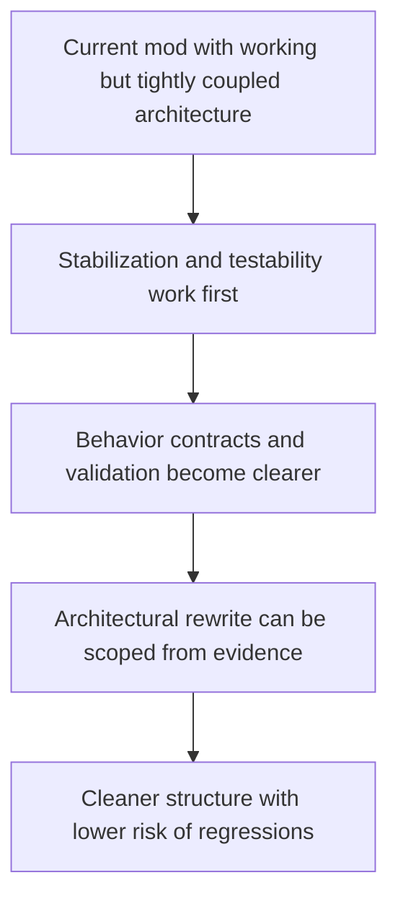

## req_004_prepare_clean_architecture_rewrite_after_stabilization - Prepare a clean architecture rewrite after stabilization
> From version: 2.1.227
> Status: Draft
> Understanding: 94%
> Confidence: 94%
> Complexity: High
> Theme: Architecture
> Reminder: Update status/understanding/confidence and references when you edit this doc.

# Needs
- Capture the idea of a cleaner long-term rewrite without turning it into an immediate refactor mandate.
- Ensure any future rewrite is prepared from a stabilized, documented, and testable baseline instead of being started in reaction to current inconsistencies.
- Define the architectural goals that would justify a rewrite later, so preparatory work can be aligned now.

# Context
The current codebase can still be improved incrementally and should not be rewritten immediately.

The preceding review requests already define the correct order of operations:
- stabilize mod loading, packaging, and export consistency
- align documentation and secondary API consistency
- improve testability, testing, and CI hardening

Only after those foundations are in place should a cleaner rewrite be considered.

The reason is practical:

1. Rewriting now would preserve too much uncertainty.
Current issues around startup ordering, runtime coupling, documentation drift, and lack of automated validation would likely be reintroduced in a different form.

2. The current project already contains valuable working behavior.
Collectors, ETA calculations, export structure, changelog logic, notification sharing, and panel injection should be treated as behavior to preserve, not as code to replace blindly.

3. A future rewrite should be driven by target architecture goals, not by discomfort with the current code style alone.

The likely long-term architectural goals are:
- separate pure domain logic from Melvor runtime integration
- make dependencies explicit instead of routing everything through a global module manager/service locator
- formalize shared contracts for export payloads, ETA objects, settings, and storage records
- isolate UI rendering/injection concerns from business logic
- enable reliable testing outside the live game runtime
- support safer evolution of panels, collectors, and export features with lower regression risk

The preferred approach is progressive preparation:
- identify seams in the current code
- extract pure logic incrementally
- define stable interfaces and contracts
- add validation around preserved behavior
- decide later whether the remaining runtime/UI layer still justifies a larger rewrite

This request is therefore a preparation request, not a direct authorization to rewrite the full mod immediately.

# Acceptance criteria
- The request explicitly states that a cleaner rewrite is a post-stabilization initiative, not the current execution priority.
- The request identifies the main architectural goals for a future rewrite, including runtime isolation, explicit dependencies, stronger contracts, and better testability.
- The request defines incremental preparation work as the preferred path before any large rewrite decision.
- The request frames the existing feature behavior as something to preserve through contracts and validation, not something to discard casually.
- The scope excludes an immediate full rewrite of the mod and excludes using architectural cleanup as a substitute for the stabilization, documentation, and testing work already identified.

# Definition of Ready (DoR)
- [x] Problem statement is explicit and user impact is clear.
- [x] Scope boundaries (in/out) are explicit.
- [x] Acceptance criteria are testable.
- [x] Dependencies and known risks are listed.

# Backlog
- None yet.
- `item_003_prepare_a_clean_architecture_rewrite_after_stabilization`
