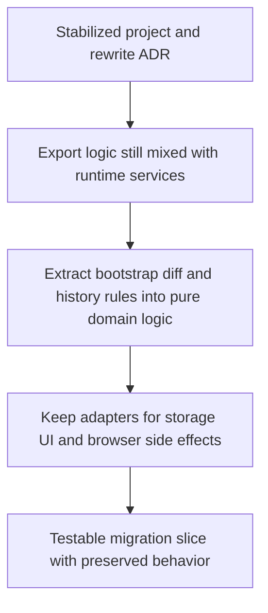

## req_005_extract_export_domain_logic_behind_runtime_adapters - Extract export domain logic behind runtime adapters
> From version: 3.0.0
> Status: Ready
> Understanding: 93%
> Confidence: 95%
> Complexity: Medium
> Theme: Architecture
> Reminder: Update status/understanding/confidence and references when you edit this doc.

# Needs
- Start the first real execution slice of the clean-architecture migration without triggering a broad rewrite.
- Extract the most valuable export-related business rules from Melvor runtime and browser services so they can be tested and evolved as pure logic.
- Preserve the current export behavior, payload shape, and UI-facing flows while reducing coupling inside the implementation.

# Context
The project now has a stabilized startup path, lightweight validation, initial tests, and an architecture target recorded in `adr_000_runtime_boundary_and_rewrite_preparation`.

The next practical step should not be a full rewrite of the mod.
It should be a narrow migration slice that proves the target architecture can be introduced incrementally.

The best first slice is the export domain because it contains meaningful business logic with lower UI and runtime risk than page injection or collector wiring.

The current export flow mixes several concerns together:
- export bootstrap from persisted storage
- export payload caching and reset rules
- diff generation between exports
- changelog and export-history rules
- browser/runtime side effects such as downloads, clipboard sharing, notifications, and storage access

Today, these concerns are spread across runtime-facing modules such as:
- `modules/export.mjs`
- `modules/viewer.mjs`
- `modules/localStorage.mjs`
- `modules/cloudStorage.mjs`

That structure works, but it makes the export behavior harder to reason about, test, and reuse.
It also keeps the future rewrite too abstract because the first runtime boundary has not yet been carved out in code.

This request therefore focuses on a constrained migration:
- define a pure export-domain layer for bootstrap, diff, and history rules
- keep Melvor/browser integration behind adapters or orchestration code
- preserve the current UI and external behavior by default
- add tests around the extracted behavior so the seam becomes trustworthy

This request is intentionally not about redesigning the export format, changing the user flow, or replacing the current mod UI.

# Acceptance criteria
- A first architecture migration slice is defined explicitly around export bootstrap, diff generation, and changelog or history behavior rather than around a broad rewrite of the whole mod.
- The request states that pure domain logic should be extracted behind runtime adapters or orchestration code, with browser and Melvor side effects kept outside the domain layer.
- The request defines behavior preservation as a primary constraint, including the current export payload shape and existing user-visible export flows unless a later request changes them deliberately.
- The request identifies the main runtime-facing modules that will need to cooperate with the extracted seam, including `modules/export.mjs` and the current storage or viewer integration points.
- The request requires automated checks for the extracted export-domain behavior so the seam becomes testable outside the live Melvor runtime.
- The scope excludes a redesign of collectors, ETA features, page injection, and a full UI rewrite.

# Definition of Ready (DoR)
- [x] Problem statement is explicit and user impact is clear.
- [x] Scope boundaries (in/out) are explicit.
- [x] Acceptance criteria are testable.
- [x] Dependencies and known risks are listed.

# Backlog
- None yet.
- `item_004_extract_export_domain_logic_behind_runtime_adapters`
