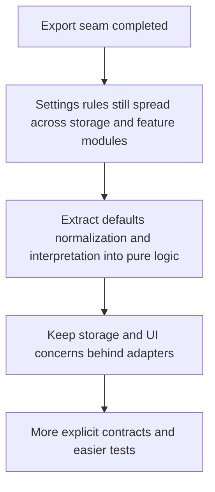

## req_006_extract_settings_domain_logic_behind_storage_adapters - Extract settings domain logic behind storage adapters
> From version: 3.0.0
> Status: Ready
> Understanding: 93%
> Confidence: 95%
> Complexity: Medium
> Theme: Architecture
> Reminder: Update status/understanding/confidence and references when you edit this doc.

# Needs
- Define the second clean-architecture migration slice around settings interpretation and normalization.
- Extract the settings rules that are currently spread across storage, setup, and feature modules so they can be tested as pure logic.
- Reduce ambiguity between default values, stored values, displayed settings, and the settings that are actually applied at runtime.

# Context
After the export-domain seam, the next most valuable extraction target is settings logic.

This seam is a good second step because it is broadly useful across the mod while staying less risky than ETA or page-injection work.
Settings influence startup, export behavior, storage choices, and several UI-facing toggles, but the underlying rules are still distributed across multiple modules.

The current structure mixes several concerns:
- canonical setting definitions
- default values
- normalization of stored values
- cloud and local storage loading
- feature-specific interpretation helpers
- UI-facing labels and runtime-facing application logic

These concerns currently interact across modules such as:
- `modules/settings.mjs`
- `modules/cloudStorage.mjs`
- `modules/localStorage.mjs`
- `setup.mjs`
- `modules/export.mjs`

That distribution makes it harder to reason about which value is authoritative at any given moment.
It also increases the chance that a setting is exposed in the UI with wording or behavior that drifts from the actual runtime effect.

This request therefore focuses on a narrow migration:
- define a pure settings-domain layer for defaults, normalization, validation, and interpretation
- keep storage access and UI rendering behind adapters or orchestration modules
- preserve the current settings surface and user-visible behavior unless a later request changes them explicitly
- add automated tests around settings merging and interpretation rules

This request does not aim to redesign the settings UI or to move every storage implementation detail immediately.

# Acceptance criteria
- A dedicated settings migration slice is defined around defaults, normalization, validation, and interpretation rather than around UI redesign or storage replacement alone.
- The request states that settings domain logic should be extracted as pure logic behind storage adapters and orchestration code.
- The request identifies the main modules currently involved in settings behavior, including `modules/settings.mjs`, `modules/cloudStorage.mjs`, `modules/localStorage.mjs`, and selected consumers such as `setup.mjs` or `modules/export.mjs`.
- The request defines behavior preservation as a constraint, so the current visible settings surface and effective runtime behavior remain stable unless explicitly changed later.
- The request requires automated checks for settings normalization and interpretation scenarios outside the live Melvor runtime.
- The scope excludes a full settings UI rewrite, ETA redesign, collector changes, and a general replacement of all storage code in one pass.

# Definition of Ready (DoR)
- [x] Problem statement is explicit and user impact is clear.
- [x] Scope boundaries (in/out) are explicit.
- [x] Acceptance criteria are testable.
- [x] Dependencies and known risks are listed.

# Backlog
- None yet.
- `item_005_extract_settings_domain_logic_behind_storage_adapters`
