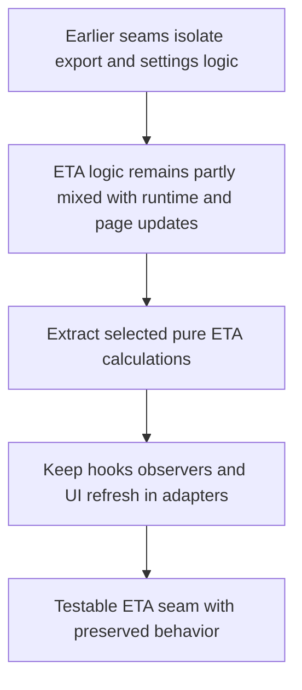

## req_007_extract_selected_eta_calculations_behind_runtime_adapters - Extract selected ETA calculations behind runtime adapters
> From version: 3.0.0
> Status: Ready
> Understanding: 92%
> Confidence: 94%
> Complexity: High
> Theme: Architecture
> Reminder: Update status/understanding/confidence and references when you edit this doc.

# Needs
- Define the third clean-architecture migration slice around ETA calculations that can be detached safely from direct runtime and UI concerns.
- Extract the most reusable ETA and rate-calculation rules into pure logic so they can be tested independently from Melvor hooks and DOM updates.
- Reduce the amount of calculation behavior embedded directly inside runtime-facing modules before any broader rewrite of panels or page integration.

# Context
After export-domain and settings-domain extraction, the next higher-value seam is selected ETA logic.

This seam should be taken after the earlier slices because ETA behavior is more tightly coupled to runtime state, activity context, and page refresh behavior.
That makes it more powerful, but also riskier.

The current ETA flow mixes several concerns:
- interpretation of activity and combat context
- reusable rate and duration calculations
- formatting and presentation-ready values
- DOM or panel refresh timing
- direct runtime data access and page-patch lifecycle behavior

These concerns currently interact across modules such as:
- `modules/eta.mjs`
- `modules/pages.mjs`
- `modules/collector.mjs`
- selected helpers in `modules/utils.mjs`

Some parts of ETA logic should remain adapter-facing because they depend directly on the live Melvor runtime or on injected page components.
However, selected calculation rules are strong candidates for extraction:
- pure duration and rate calculations
- reusable summary helpers
- transformation of normalized activity inputs into ETA-oriented outputs

This request therefore focuses on a constrained migration:
- identify and extract only ETA calculations that can be made pure without destabilizing page behavior
- keep runtime observation, patch hooks, and UI refresh logic outside the domain layer
- preserve current ETA outputs and user-visible behavior by default
- add automated checks for the extracted calculation rules

This request does not authorize a rewrite of the entire ETA system or page injection layer in one pass.

# Acceptance criteria
- A dedicated ETA migration slice is defined around selected pure calculations rather than around a full rewrite of `modules/eta.mjs` or page injection.
- The request states that runtime observation, hooks, and UI refresh behavior should remain outside the extracted ETA domain logic.
- The request identifies the main ETA-related modules currently involved, including `modules/eta.mjs`, `modules/pages.mjs`, `modules/collector.mjs`, and any shared helpers that participate in ETA calculations.
- The request defines behavior preservation as a constraint, so the current ETA outputs remain stable unless deliberately changed later.
- The request requires automated checks for the extracted ETA calculations outside the live Melvor runtime.
- The scope excludes collector redesign, UI panel redesign, and a one-shot replacement of the full runtime-linked ETA pipeline.

# Definition of Ready (DoR)
- [x] Problem statement is explicit and user impact is clear.
- [x] Scope boundaries (in/out) are explicit.
- [x] Acceptance criteria are testable.
- [x] Dependencies and known risks are listed.

# Backlog
- None yet.
- `item_006_extract_selected_eta_calculations_behind_runtime_adapters`
