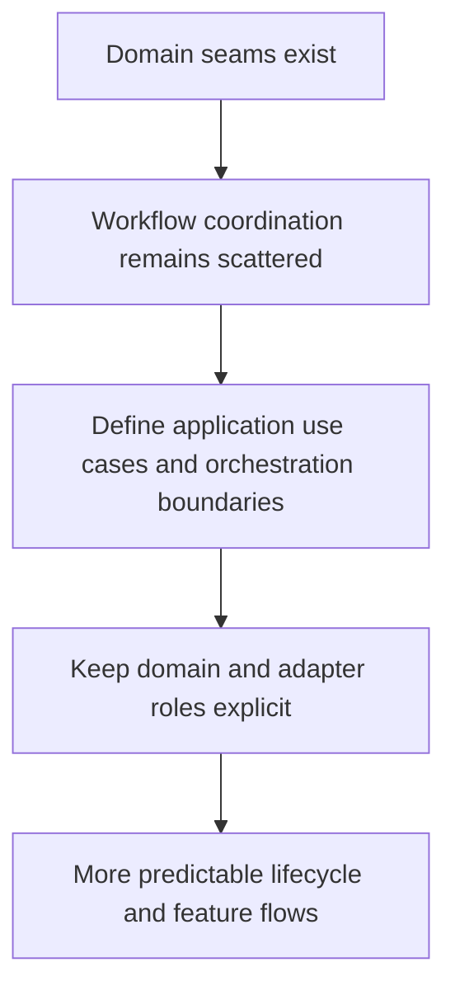

## req_008_define_application_orchestration_between_domain_and_runtime_adapters - Define application orchestration between domain and runtime adapters
> From version: 3.0.0
> Status: Ready
> Understanding: 92%
> Confidence: 94%
> Complexity: High
> Theme: Architecture
> Reminder: Update status/understanding/confidence and references when you edit this doc.

# Needs
- Define the application-orchestration layer that should coordinate domain logic and runtime adapters once the first domain seams are extracted.
- Reduce the amount of workflow coordination currently embedded directly in module bootstrap code and feature modules.
- Make use cases explicit so startup, export, settings, ETA, and UI flows stop relying on implicit cross-module behavior.

# Context
After export, settings, and selected ETA seams are extracted, the next structural weakness will be orchestration.

Today, the project still coordinates most behavior through a mix of:
- `setup.mjs`
- `modules.mjs`
- feature modules calling each other through the module manager
- lifecycle hooks that implicitly mix runtime access, business decisions, and UI triggering

That structure is workable, but it keeps the new domain seams from becoming a coherent architecture.
Without an orchestration layer, pure logic may exist, yet flow decisions will remain scattered across runtime-facing modules.

The application-orchestration seam should define use cases such as:
- startup initialization sequencing
- export generation and persistence orchestration
- export viewing or sharing flows
- settings loading and application flow
- ETA refresh or recomputation triggers

This layer should sit between domain logic and adapters:
- it can call domain services and policies
- it can depend on runtime adapters for side effects
- it should not own low-level Melvor APIs directly
- it should not render UI directly

This request therefore focuses on a bounded architectural step:
- define explicit application-level use cases and orchestration boundaries
- identify which current workflows belong there
- preserve current feature behavior while moving coordination out of the service-locator style module web
- prepare the codebase for adapter and UI isolation without forcing a one-shot rewrite

This request is not about redesigning individual domain rules or rebuilding the entire bootstrap system at once.

# Acceptance criteria
- A dedicated orchestration migration slice is defined around explicit use cases and workflow coordination rather than around new domain extraction alone.
- The request states that orchestration should sit between domain logic and runtime adapters, without taking ownership of low-level Melvor APIs or direct UI rendering.
- The request identifies the main current orchestration hotspots, including `setup.mjs`, `modules.mjs`, and selected runtime-facing feature modules.
- The request defines behavior preservation as a constraint so startup, export, settings, and ETA flows remain stable while coordination responsibilities move.
- The request requires automated checks or scenario-based validation for the main orchestrated flows that are migrated.
- The scope excludes a full rewrite of every module, direct collector redesign, and a visual redesign of any UI surface.

# Definition of Ready (DoR)
- [x] Problem statement is explicit and user impact is clear.
- [x] Scope boundaries (in/out) are explicit.
- [x] Acceptance criteria are testable.
- [x] Dependencies and known risks are listed.

# Backlog
- None yet.
- `item_007_define_application_orchestration_between_domain_and_runtime_adapters`
