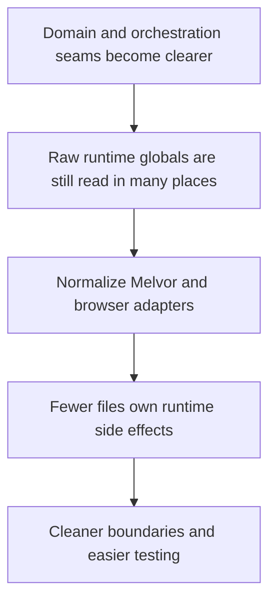

## req_009_normalize_melvor_and_browser_runtime_adapters - Normalize Melvor and browser runtime adapters
> From version: 3.0.0
> Status: Ready
> Understanding: 92%
> Confidence: 94%
> Complexity: High
> Theme: Architecture
> Reminder: Update status/understanding/confidence and references when you edit this doc.

# Needs
- Define a dedicated migration slice for normalizing the runtime adapters that interact with Melvor globals and browser services.
- Replace scattered direct reads of runtime services with clearer adapter boundaries that are easier to test, reason about, and swap during future refactors.
- Reduce hidden coupling to `game`, `ui`, `Swal`, `localStorage`, `Notification`, clipboard, downloads, and patch hooks.

# Context
After domain seams and orchestration become clearer, the next architectural need is adapter normalization.

The current project still accesses runtime services in many places:
- Melvor runtime globals such as `game` and loader hooks
- browser APIs such as `localStorage`, clipboard, notifications, and download behavior
- UI services such as `ui` and `Swal`
- patching and lifecycle APIs exposed by the mod loader

Those accesses are not consistently hidden behind a small number of explicit adapter contracts.
As a result:
- runtime dependencies remain hard to inventory
- tests still need to mock too many surfaces
- feature code can easily regain direct coupling even after domain extraction work

This request therefore focuses on a constrained migration:
- define clear runtime-adapter categories for Melvor services and browser services
- identify the current modules that should stop reading these globals directly
- move toward stable adapter contracts for storage, notifications, clipboard or sharing, downloads, runtime state reads, and hook or patch access
- preserve current behavior while reducing how many files are allowed to touch raw runtime globals

This request should happen after the first domain seams and orchestration work because adapter boundaries are easier to define once domain and use-case responsibilities are clearer.

This request is not about replacing all runtime-facing code immediately, nor about changing the visible product behavior.

# Acceptance criteria
- A dedicated adapter-normalization migration slice is defined around Melvor and browser service boundaries rather than around another domain-only extraction.
- The request states that direct access to runtime globals and browser services should be reduced in favor of explicit adapter contracts.
- The request identifies the main runtime surfaces to normalize, including `game`, loader hooks, patch APIs, `ui`, `Swal`, browser storage, notifications, clipboard, and download behavior.
- The request defines behavior preservation as a constraint so current storage, sharing, startup, and UI side effects remain stable while adapter ownership is clarified.
- The request requires automated checks or focused validation scenarios for the adapter-backed behaviors that are migrated.
- The scope excludes a full rewrite of all runtime modules in one pass and excludes changing user-facing features for their own sake.

# Definition of Ready (DoR)
- [x] Problem statement is explicit and user impact is clear.
- [x] Scope boundaries (in/out) are explicit.
- [x] Acceptance criteria are testable.
- [x] Dependencies and known risks are listed.

# Backlog
- None yet.
- `item_008_normalize_melvor_and_browser_runtime_adapters`
