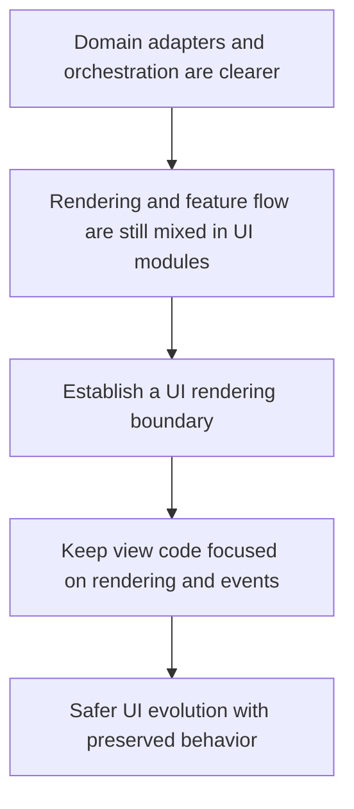

## req_010_establish_a_ui_rendering_boundary_for_injected_views_and_panels - Establish a UI rendering boundary for injected views and panels
> From version: 3.0.0
> Status: Ready
> Understanding: 91%
> Confidence: 93%
> Complexity: High
> Theme: Architecture
> Reminder: Update status/understanding/confidence and references when you edit this doc.

# Needs
- Define a dedicated migration slice for separating UI rendering and injected page behavior from domain logic and orchestration.
- Reduce the amount of view state, event handling, and runtime coordination currently intertwined inside export views, changelog views, and injected page panels.
- Prepare the codebase for future UI changes without forcing current feature logic to stay embedded in rendering modules.

# Context
After domain seams, orchestration, and adapter boundaries are in place, the next major pressure point is the UI layer.

The current project mixes several UI concerns across modules such as:
- `views/exportView.mjs`
- `views/changelogView.mjs`
- `modules/viewer.mjs`
- `modules/pages.mjs`

These files currently combine different responsibilities:
- DOM creation or mutation
- modal and panel rendering
- event wiring
- flow control and action triggering
- runtime-driven updates and refresh behavior

That structure is normal for a small mod, but it becomes a limiting factor once domain logic and orchestration are cleaner.
Without a UI boundary:
- rendering logic remains harder to test
- view state and business actions remain tightly coupled
- future UI changes will keep pulling logic back into rendering modules

This request therefore focuses on a constrained migration:
- define a UI rendering boundary for modals, changelog views, and injected panels
- separate rendering concerns from orchestration and domain decisions
- keep current user-visible UI behavior stable unless later requests deliberately change it
- preserve the current injection model while reducing feature logic inside rendering modules

This request is not about visual redesign, theme changes, or rewriting all UI files at once.

# Acceptance criteria
- A dedicated UI migration slice is defined around rendering boundaries for modals and injected panels rather than around a full front-end rewrite.
- The request states that rendering modules should focus on view construction, DOM updates, and event binding, while business decisions and orchestration stay elsewhere.
- The request identifies the main UI-facing modules currently involved, including `views/exportView.mjs`, `views/changelogView.mjs`, `modules/viewer.mjs`, and `modules/pages.mjs`.
- The request defines behavior preservation as a constraint so current modal flows, diff viewing, changelog display, and panel behavior remain stable unless changed by a later request.
- The request requires validation for the migrated UI boundaries, whether through focused tests, adapter-backed checks, or explicit scenario verification.
- The scope excludes a redesign of visual identity, a wholesale replacement of the injection mechanism, and collector or ETA logic redesign by itself.

# Definition of Ready (DoR)
- [x] Problem statement is explicit and user impact is clear.
- [x] Scope boundaries (in/out) are explicit.
- [x] Acceptance criteria are testable.
- [x] Dependencies and known risks are listed.

# Backlog
- None yet.
- `item_009_establish_a_ui_rendering_boundary_for_injected_views_and_panels`
