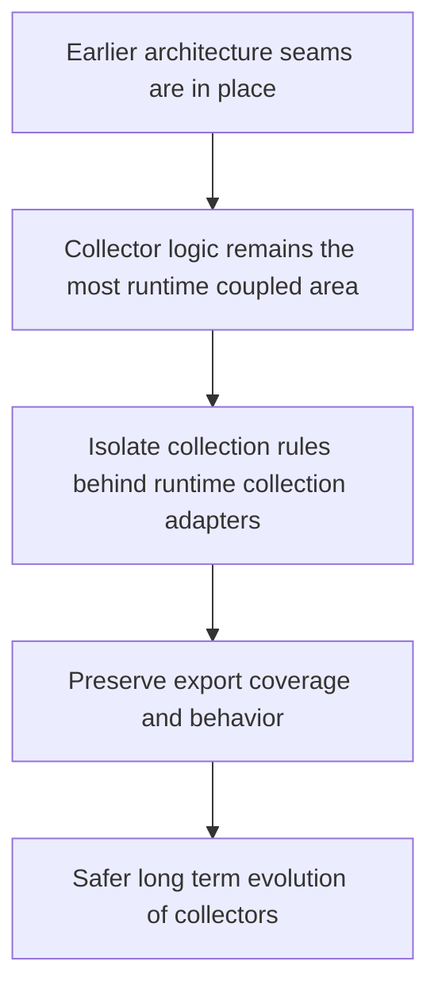

## req_011_isolate_collector_logic_behind_runtime_collection_adapters - Isolate collector logic behind runtime collection adapters
> From version: 3.0.0
> Status: Done
> Understanding: 97%
> Confidence: 97%
> Complexity: High
> Theme: Architecture
> Reminder: Update status/understanding/confidence and references when you edit this doc.

# Needs
- Define the later-stage migration slice for isolating collector logic from direct runtime data access.
- Reduce the tight coupling between collection rules and the live Melvor runtime while preserving the current export schema and gameplay data coverage.
- Prepare the most runtime-heavy part of the mod for safer long-term maintenance once earlier architecture seams are already in place.

# Context
Collector logic is likely the most runtime-coupled part of the project and should therefore be addressed later, not earlier.

Today, modules such as `modules/collector.mjs` read and assemble gameplay state directly from the live Melvor runtime.
That is necessary for the current product, but it also creates the hardest architectural knot in the codebase because collection responsibilities are close to:
- raw game-state access
- export-shape assembly
- feature-specific branching
- progression and activity interpretation
- dependencies on the broader runtime model

If collector isolation is attempted too early, it risks destabilizing the mod before the architectural groundwork is ready.
That is why this request belongs after:
- export-domain extraction
- settings-domain extraction
- selected ETA extraction
- application orchestration
- runtime-adapter normalization
- UI-boundary clarification

By that point, collector work can be scoped more safely:
- isolate runtime collection adapters from gameplay aggregation rules
- preserve the current export payload and collector coverage by default
- make collection rules easier to validate with fixtures or controlled runtime inputs
- reduce the number of modules that need direct access to raw game objects

This request is intentionally a later-stage request.
It is not a signal to rewrite all collectors immediately.

# Acceptance criteria
- A later-stage collector migration slice is defined around separating runtime collection adapters from collector aggregation rules.
- The request states that collector isolation should happen only after earlier domain, orchestration, adapter, and UI seams are materially in place.
- The request identifies the main collector-related hotspot, especially `modules/collector.mjs`, plus the parts of the project that consume its output.
- The request defines behavior preservation as a constraint so current export schema expectations and data coverage remain stable unless later requests change them deliberately.
- The request requires a validation strategy for migrated collector behavior, such as fixture-based checks, controlled runtime inputs, or equivalent automated verification.
- The scope excludes a one-shot replacement of every collector path, a redesign of export schema content, and unrelated UI or ETA feature changes.

# Definition of Ready (DoR)
- [x] Problem statement is explicit and user impact is clear.
- [x] Scope boundaries (in/out) are explicit.
- [x] Acceptance criteria are testable.
- [x] Dependencies and known risks are listed.

# Backlog
- None yet.
- `item_010_isolate_collector_logic_behind_runtime_collection_adapters`

# Outcome
- Collector-boundary work landed through `modules/collectorAdapter.mjs`, which defines explicit export collector descriptors, callback wiring for activity collection, and fixture-backed boundary validation.
- `modules/export.mjs` no longer carries the collector export mapping as a raw hard-coded list; it now consumes the collector plan while preserving the current export schema and legacy fallback messages.
- Selected collector aggregation rules now live in `modules/collectorDomain.mjs`, while `modules/collector.mjs` remains responsible for raw runtime access. This reduces runtime coupling for basics, skills, mastery, agility, and active potions without forcing a one-shot rewrite of every collector path.
