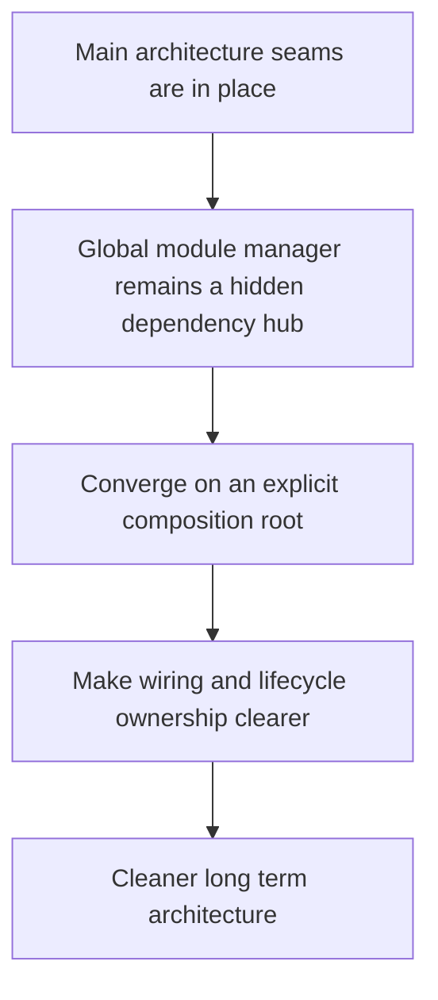

## req_012_converge_on_an_explicit_composition_root_and_reduce_the_global_module_manager - Converge on an explicit composition root and reduce the global module manager
> From version: 3.0.0
> Status: Ready
> Understanding: 91%
> Confidence: 93%
> Complexity: High
> Theme: Architecture
> Reminder: Update status/understanding/confidence and references when you edit this doc.

# Needs
- Define the convergence step that replaces the current service-locator style module manager with a clearer composition root.
- Make dependency wiring explicit once the main domain, orchestration, adapter, and UI seams are already in place.
- Reduce hidden cross-module coupling and make application startup easier to reason about and evolve.

# Context
After the planned architecture seams are implemented, the project should no longer rely on the current global module manager as the primary dependency carrier.

Today, `modules.mjs` still acts as a broad service locator and lifecycle hub.
That role was acceptable while the codebase was smaller and less structured, but it becomes a source of ambiguity once:
- domain logic is extracted
- application orchestration exists
- runtime adapters are normalized
- UI boundaries are clearer

At that point, continuing to route dependencies through a global module container would limit the benefits of the migration work.

The intended next step is convergence around a composition root:
- centralize startup wiring
- make constructed dependencies explicit
- reduce feature-to-feature direct knowledge
- keep lifecycle sequencing readable and testable

This request therefore focuses on a constrained convergence step:
- define what the composition root should own
- identify what should stop living in `modules.mjs`
- preserve current runtime behavior while reducing service-locator usage
- prepare the codebase for a stable long-term architecture instead of an endless hybrid state

This request is not about introducing a complex dependency injection framework or rewriting the whole application bootstrap from scratch in one pass.

# Acceptance criteria
- A convergence request is defined around introducing an explicit composition root and reducing the service-locator role of `modules.mjs`.
- The request states that dependency wiring and lifecycle composition should become explicit once earlier architecture seams are established.
- The request identifies the current hotspots involved in composition, especially `setup.mjs` and `modules.mjs`.
- The request defines behavior preservation as a constraint so startup, feature wiring, and user-visible flows remain stable during convergence.
- The request requires validation for the migrated composition flow, including startup and core feature wiring scenarios.
- The scope excludes adopting a heavyweight DI framework, redesigning features for their own sake, or restarting architecture work from scratch.

# Definition of Ready (DoR)
- [x] Problem statement is explicit and user impact is clear.
- [x] Scope boundaries (in/out) are explicit.
- [x] Acceptance criteria are testable.
- [x] Dependencies and known risks are listed.

# Backlog
- None yet.
- `item_011_converge_on_an_explicit_composition_root_and_reduce_the_global_module_manager`
