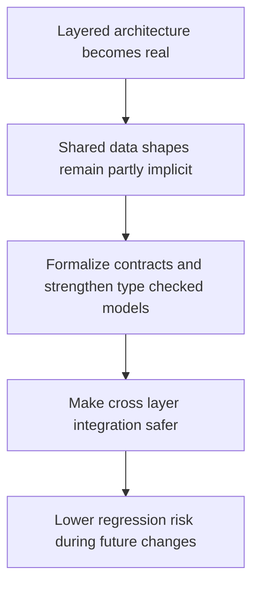

## req_013_formalize_shared_contracts_and_strengthen_type_checked_data_models - Formalize shared contracts and strengthen type checked data models
> From version: 3.0.0
> Status: In progress
> Understanding: 95%
> Confidence: 96%
> Complexity: High
> Theme: Architecture
> Reminder: Update status/understanding/confidence and references when you edit this doc.

# Needs
- Define a dedicated phase for formalizing the shared data contracts that the new architecture depends on.
- Strengthen `@ts-check` era type safety without forcing a blanket TypeScript rewrite.
- Reduce ambiguity around export payloads, ETA structures, settings values, collector outputs, and storage records.

# Context
After the main architecture seams are in place, the project will rely increasingly on explicit contracts between layers.

Without stronger shared contracts, the migration would still be fragile because:
- domain logic could drift from adapters
- orchestration could pass partially shaped objects
- UI layers could assume fields that are no longer guaranteed
- tests could cover behavior while missing structural inconsistencies

The current project uses `// @ts-check`, but many important data shapes remain implicit or only informally documented.
This becomes a bigger risk as soon as the codebase is split into more layers and more reusable services.

The most important contract families are likely:
- export payload structure
- export diff and history records
- ETA inputs and outputs
- settings definitions and normalized values
- collector output records
- storage record shapes

This request therefore focuses on a bounded hardening step:
- define the most important shared contracts explicitly
- improve type-checked data modeling in ways compatible with the current codebase
- preserve runtime behavior while making invalid states harder to represent
- support stronger tests and safer refactors across layers

This request is not a demand for a full TypeScript migration or a complete rewrite of all files into typed classes or schemas.

# Acceptance criteria
- A dedicated contract-hardening request is defined around shared payloads and type-checked data models rather than around a full TypeScript rewrite.
- The request states that the project should strengthen explicit contracts for export, ETA, settings, collector, and storage data where they matter most.
- The request defines compatibility with the current `@ts-check` approach as acceptable, provided shared contracts become materially stronger.
- The request defines behavior preservation as a constraint so contract work does not change product behavior by itself.
- The request requires validation or checks that exercise both behavior and structural expectations for the formalized contracts.
- The scope excludes a blanket migration of every file to TypeScript and excludes unrelated feature redesign.

# Definition of Ready (DoR)
- [x] Problem statement is explicit and user impact is clear.
- [x] Scope boundaries (in/out) are explicit.
- [x] Acceptance criteria are testable.
- [x] Dependencies and known risks are listed.

# Backlog
- None yet.
- `item_012_formalize_shared_contracts_and_strengthen_type_checked_data_models`

# Outcome
- Shared contract hardening has started with `modules/contracts.mjs`, which now defines explicit validators for settings references, persisted setting entries, export meta payloads, and export changes-history maps.
- `modules/settingsDomain.mjs` and `modules/exportDomain.mjs` now apply those contracts to reject malformed persisted structures without changing current product behavior.
- The remaining work for this request is the second slice that formalizes ETA, collector, and storage record contracts via `task_018_formalize_eta_collector_and_storage_contracts`.
