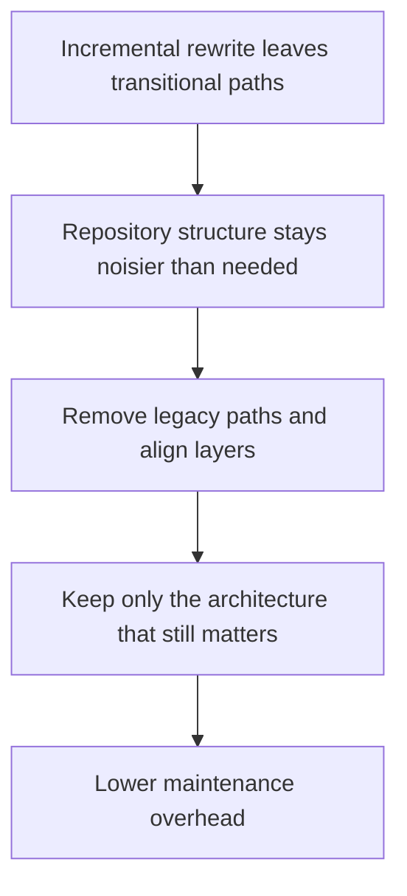

## req_014_remove_legacy_paths_and_align_the_repository_to_architecture_layers - Remove legacy paths and align the repository to architecture layers
> From version: 3.0.0
> Status: Done
> Understanding: 100%
> Confidence: 96%
> Complexity: Medium
> Theme: Architecture
> Reminder: Update status/understanding/confidence and references when you edit this doc.

# Needs
- Define the cleanup phase that removes outdated paths and aligns the repository structure with the architecture that has already been introduced.
- Reduce long-term maintenance cost by removing redundant code paths, transitional helpers, and layer violations left behind by the incremental migration.
- Make the repository easier to navigate once the main architecture has stabilized.

# Context
Incremental migration is safer than a big rewrite, but it creates an expected side effect:
for a while, the repository contains both new architecture slices and legacy paths kept for transition.

That is acceptable during migration, but not as a permanent state.
If the project stops after seam extraction and convergence without cleanup:
- old and new responsibilities will coexist too long
- developers will have multiple places to modify the same behavior
- the intended architecture will remain harder to understand than necessary

This request therefore focuses on a bounded cleanup phase:
- identify legacy paths that became redundant after migration
- remove or fold transitional code that no longer serves a real compatibility need
- align directories and module ownership with the established architecture layers
- preserve runtime behavior while simplifying the repository structure

Typical targets may include:
- obsolete helper paths replaced by domain or adapter services
- service-locator access patterns that remain only for historical reasons
- duplicate normalization or formatting logic
- transitional wrappers that can be deleted once the new paths are fully adopted

This request is not about another redesign round.
It is about finishing the migration properly so the new structure becomes the real structure.

# Acceptance criteria
- A dedicated cleanup request is defined around removing legacy paths and aligning repository structure with the adopted architecture layers.
- The request states that transitional code should be removed once it no longer serves a real compatibility or migration purpose.
- The request defines behavior preservation as a constraint so cleanup does not become a disguised feature rewrite.
- The request requires validation to confirm that the cleaned-up paths preserve startup, export, settings, ETA, and UI behavior that the migration already stabilized.
- The scope excludes speculative redesign, brand-new feature work, and deleting compatibility paths that are still required by active migration slices.
- The request keeps repository clarity and long-term maintainability as the primary reason for the cleanup phase.

# Definition of Ready (DoR)
- [x] Problem statement is explicit and user impact is clear.
- [x] Scope boundaries (in/out) are explicit.
- [x] Acceptance criteria are testable.
- [x] Dependencies and known risks are listed.

# Backlog
- None yet.
- `item_013_remove_legacy_paths_and_align_the_repository_to_architecture_layers`

# Outcome
- Cleanup is now complete through `item_013_remove_legacy_paths_and_align_the_repository_to_architecture_layers`.
- Transitional helper wrappers that no longer served a compatibility purpose were removed from export and viewer-facing modules while preserving current behavior.
- Local tests, manifest validation, packaging validation, and workflow/logics audits stayed green after the cleanup slice.
