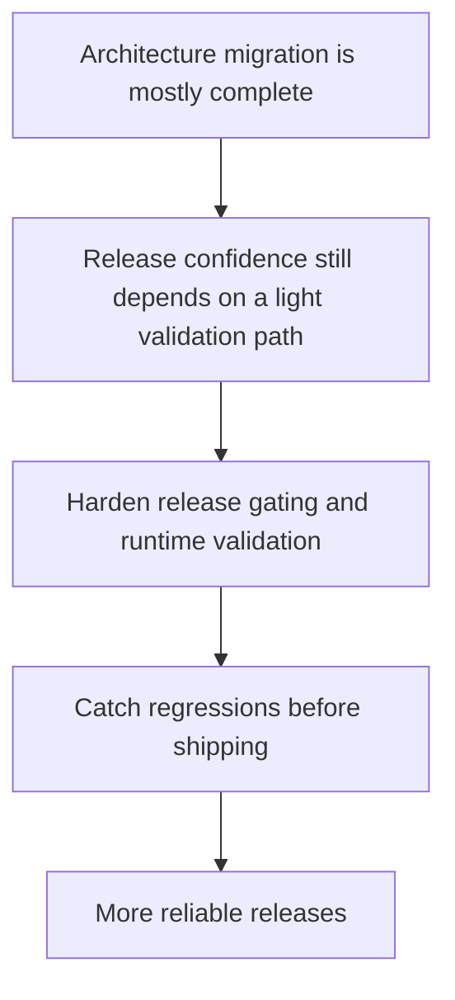

## req_015_harden_release_gating_packaging_and_runtime_validation - Harden release gating packaging and runtime validation
> From version: 3.0.0
> Status: Ready
> Understanding: 90%
> Confidence: 92%
> Complexity: Medium
> Theme: Reliability
> Reminder: Update status/understanding/confidence and references when you edit this doc.

# Needs
- Define the post-migration reliability step for release discipline, packaging checks, and runtime validation.
- Reduce the chance that future releases regress startup, packaging, exports, or injected UI behavior after architecture work has landed.
- Turn the current lightweight validation path into a more dependable release gate.

# Context
As the architecture becomes cleaner and more layered, the project also needs stronger release discipline.

The current validation path is useful, but still minimal.
It helps catch some packaging and document issues, yet it does not fully represent the confidence expected from a codebase that has undergone several architectural migrations.

Once the main seams, convergence, contract work, and cleanup are done, the project should harden its release gate around:
- packaging coherence
- manifest correctness
- adapter and orchestration smoke checks
- key domain test suites
- focused runtime validation scenarios

This request therefore focuses on a bounded reliability step:
- define stronger release-gating expectations
- clarify which checks must pass before shipping
- improve confidence in startup, export, settings, ETA, and UI integration behavior
- preserve the existing user-facing feature set while reducing regression risk

This request is not about adding process for its own sake.
It is about making sure the cleaner architecture stays reliable as the project keeps evolving.

# Acceptance criteria
- A dedicated release-hardening request is defined around packaging, validation, and release gating rather than around new feature development.
- The request states that the project should define a stronger minimal release gate for packaging, startup, core feature flows, and runtime-sensitive behavior.
- The request defines behavior preservation and regression prevention as the main goal of the release hardening work.
- The request requires a mix of automated checks and explicit runtime validation scenarios appropriate to the mod environment.
- The scope excludes unrelated feature redesign and excludes imposing heavy process that does not materially improve release confidence.
- The request builds on earlier testing and CI work instead of replacing it with a separate disconnected process.

# Definition of Ready (DoR)
- [x] Problem statement is explicit and user impact is clear.
- [x] Scope boundaries (in/out) are explicit.
- [x] Acceptance criteria are testable.
- [x] Dependencies and known risks are listed.

# Backlog
- None yet.
- `item_014_harden_release_gating_packaging_and_runtime_validation`
