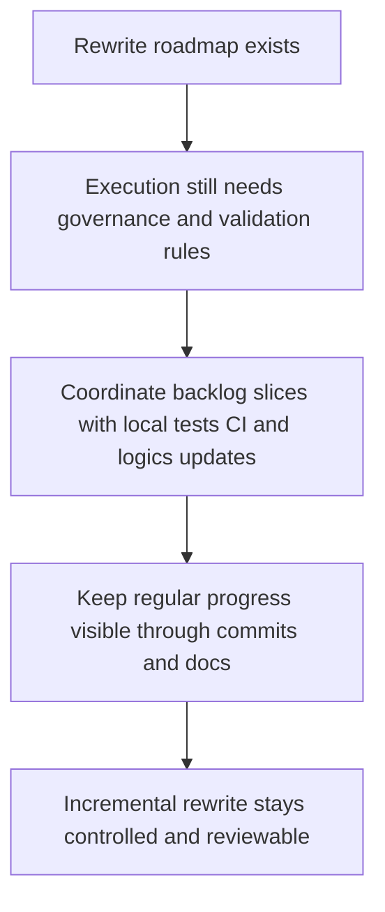

## req_016_orchestrate_incremental_rewrite_execution_governance_and_validation - Orchestrate incremental rewrite execution governance and validation
> From version: 3.0.0
> Status: In progress
> Understanding: 98%
> Confidence: 99%
> Complexity: High
> Theme: Architecture
> Reminder: Update status/understanding/confidence and references when you edit this doc.

# Needs
- Define how the full incremental rewrite roadmap should be executed and governed over time.
- Make local tests and CI the default validation path until end-of-rewrite runtime verification inside the game becomes worthwhile.
- Ensure the rewrite effort is accompanied by regular `logics` updates and regular commits so delivery remains traceable and manageable.

# Context
The project now has a multi-phase rewrite roadmap spanning:
- domain seams
- orchestration and adapter boundaries
- UI and collector isolation
- convergence, contracts, cleanup, and release hardening

The user has clarified two operating constraints:
- the mod will likely not be executed inside the live game until late in the rewrite
- local tests, CI, and repository-native validation should therefore carry most of the confidence load in the meantime

The user also expects the rewrite effort to remain operationally disciplined:
- `logics` docs should be updated regularly as progress is made
- commits should be made regularly instead of allowing large untracked waves of changes to accumulate

That means the roadmap needs a dedicated orchestration request, not just a set of isolated architecture requests.

This request therefore focuses on the execution model around the roadmap:
- define the delivery cadence for the backlog slices
- define the expected validation approach while runtime game execution is deferred
- define that `logics` updates and commit hygiene are part of the work, not optional follow-up
- keep the roadmap coordinated without pretending that all slices should be implemented in one uninterrupted change

This request does not replace the architectural requests themselves.
It provides the governance and validation frame that should steer them.

# Acceptance criteria
- The request defines a roadmap orchestration layer for executing the rewrite backlog incrementally rather than as a single large delivery.
- The request states that local tests, CI, and repository-native validation are the default confidence path until late runtime verification in the live game becomes necessary.
- The request defines regular `logics` maintenance as part of execution, including status updates on request, backlog, and task docs when slices materially move.
- The request defines regular commits as an execution expectation so changes are delivered in reviewable increments.
- The request keeps architectural implementation responsibility inside the individual backlog slices rather than collapsing everything into one oversized work item.

# Definition of Ready (DoR)
- [x] Problem statement is explicit and user impact is clear.
- [x] Scope boundaries (in/out) are explicit.
- [x] Acceptance criteria are testable.
- [x] Dependencies and known risks are listed.

# Backlog
- `item_015_orchestrate_incremental_rewrite_execution_governance_and_validation`

# Outcome
- Execution governance is now active.
- The rewrite has started with the export-domain, settings-domain, ETA-domain, and application-orchestration slices under local validation, CI-backed checks, regular `logics` updates, and checkpoint commits.
