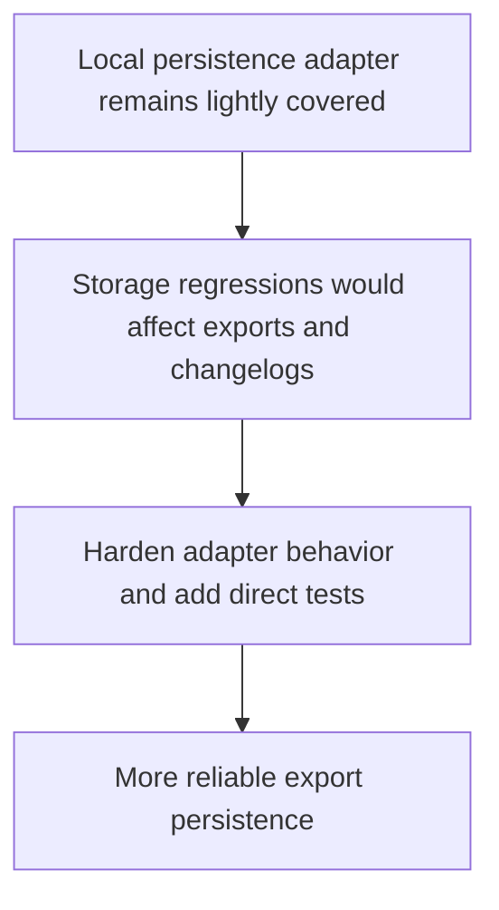

## req_017_harden_local_persistence_adapter_behavior_and_test_coverage - Harden local persistence adapter behavior and test coverage
> From version: 3.0.1
> Status: Done
> Understanding: 100%
> Confidence: 97%
> Complexity: Medium
> Theme: Reliability
> Reminder: Update status/understanding/confidence and references when you edit this doc.

# Needs
- Define a post-roadmap reliability slice around the local persistence adapter used for exports and changelog history.
- Reduce the risk of regressions in compressed storage, raw fallback storage, and character-scoped storage keys.
- Add direct test coverage for this adapter without depending on live Melvor runtime execution.

# Context
The rewrite roadmap closed the main architectural migration, release gate, and packaging work.

One runtime-adjacent area still has relatively high behavioral importance with little direct coverage:
`modules/localStorage.mjs`.

That module is responsible for:
- saving and loading the last export snapshot
- saving and loading changelog history
- character-scoped storage keys
- compressed and raw fallback persistence behavior

If this adapter regresses, the impact is immediate:
- exports appear empty between sessions
- changelog history disappears or becomes unreadable
- storage becomes inconsistent across characters

This request defines a bounded follow-up slice:
- harden the local persistence adapter behavior
- remove dead or misleading helper paths left in that module
- add direct tests around roundtrip, fallback, and cleanup behavior
- preserve the existing persisted key strategy and user-facing behavior

This request is not a broader persistence redesign.
It is a reliability and testability follow-up on a high-value adapter.

# Acceptance criteria
- A dedicated reliability request is defined around `modules/localStorage.mjs` rather than around a broader storage redesign.
- The request states that compressed roundtrip, raw fallback behavior, and character-scoped storage keys must remain stable.
- The request requires direct local tests for the persistence adapter without requiring live in-game execution.
- The request preserves the current user-facing storage behavior and key naming strategy.
- The scope excludes unrelated storage redesign and excludes changing persistence semantics for their own sake.

# Definition of Ready (DoR)
- [x] Problem statement is explicit and user impact is clear.
- [x] Scope boundaries (in/out) are explicit.
- [x] Acceptance criteria are testable.
- [x] Dependencies and known risks are listed.

# Backlog
- `item_016_harden_local_persistence_adapter_behavior_and_test_coverage`

# Outcome
- The local persistence adapter is now hardened through `item_016_harden_local_persistence_adapter_behavior_and_test_coverage`.
- `modules/localStorage.mjs` now supports direct dependency injection for local tests and no longer carries dead settings helper paths.
- Direct tests cover compressed export roundtrip, changelog roundtrip, raw fallback storage, and cleanup behavior without needing live Melvor execution.
