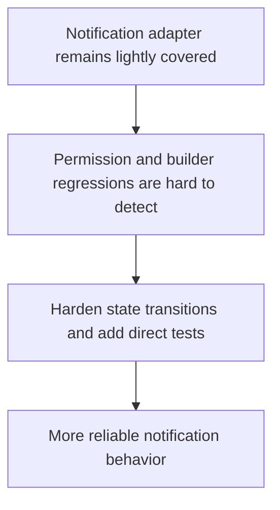

## req_018_harden_notification_adapter_state_transitions_and_test_coverage - Harden notification adapter state transitions and test coverage
> From version: 3.0.1
> Status: Done
> Understanding: 100%
> Confidence: 96%
> Complexity: Medium
> Theme: Reliability
> Reminder: Update status/understanding/confidence and references when you edit this doc.

# Needs
- Define a follow-up reliability slice around `modules/notification.mjs`.
- Reduce regression risk in permission flow, builder lifecycle, shared-notification checks, and displayable notification generation.
- Add direct tests around notification state transitions without requiring live in-game execution.

# Context
After the local persistence slice, the notification adapter is now the next runtime-adjacent module with meaningful behavior and comparatively low direct coverage.

That module coordinates:
- permission request flow
- scheduled notification builder state
- shared notification checks
- notification display payload generation

If it regresses, the result is subtle but user-visible:
- notifications silently stop firing
- stale notification builders remain persisted
- shared notifications fail to clear or display correctly

This request defines a bounded hardening slice:
- clarify or isolate the state transitions that matter
- preserve current notification semantics
- add direct tests for the most important branches

This request is not a notification redesign.
It is a reliability and testability follow-up on a runtime-heavy adapter.

# Acceptance criteria
- A dedicated reliability request is defined around `modules/notification.mjs`.
- The request states that permission flow, builder lifecycle, shared-notification checks, and display payload generation must remain stable.
- The request requires direct local tests for the notification adapter without requiring live in-game execution.
- The request preserves current user-facing notification semantics and excludes redesigning the feature set.

# Definition of Ready (DoR)
- [x] Problem statement is explicit and user impact is clear.
- [x] Scope boundaries (in/out) are explicit.
- [x] Acceptance criteria are testable.
- [x] Dependencies and known risks are listed.

# Backlog
- `item_017_harden_notification_adapter_state_transitions_and_test_coverage`

# Outcome
- The notification adapter is now hardened through `item_017_harden_notification_adapter_state_transitions_and_test_coverage`.
- `modules/notification.mjs` now supports direct dependency injection, resets internal state cleanly on init, and normalizes builders around `playerName` while staying compatible with legacy `charName` payloads.
- Direct tests now cover builder normalization, delay adjustment, permission flow, and display payload ordering without requiring live Melvor execution.
