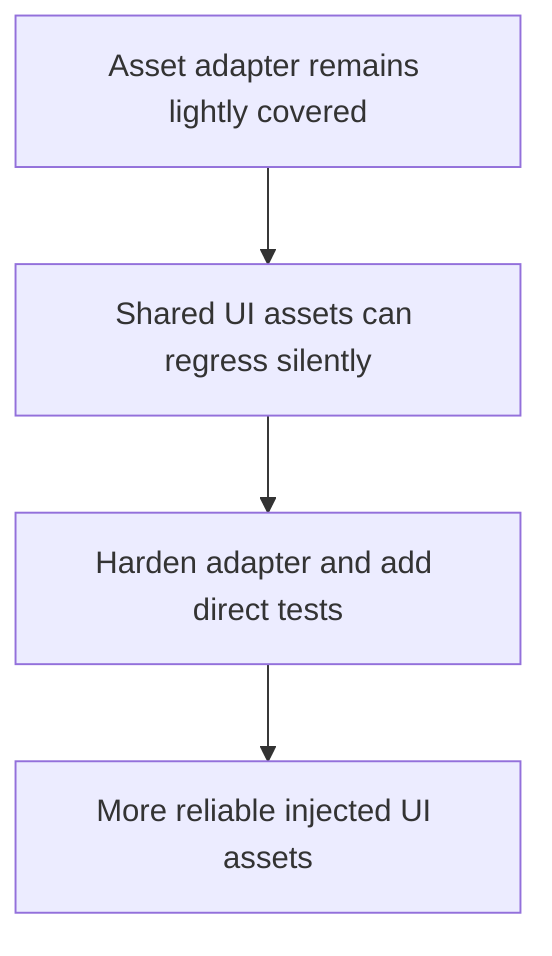

## req_019_harden_asset_manager_adapter_behavior_and_test_coverage - Harden asset manager adapter behavior and test coverage
> From version: 3.0.1
> Status: Done
> Understanding: 100%
> Confidence: 97%
> Complexity: Low
> Theme: Reliability
> Reminder: Update status/understanding/confidence and references when you edit this doc.

# Needs
- Define a bounded hardening slice around `modules/assetManager.mjs`.
- Remove dead helper paths and add direct tests for asset loading, fallback behavior, and HTML generation.
- Keep the current asset identifiers and runtime behavior unchanged.

# Context
After persistence and notification hardening, `modules/assetManager.mjs` is one of the remaining small runtime adapters with low direct coverage.

The module is simple but still important:
- it maps resource ids to resolved URLs
- it generates HTML used across the injected panels
- it swaps runtime assets in DOM fragments

This request defines a small follow-up slice:
- make dependencies explicit enough to test directly
- remove dead settings helpers still present in the module
- add direct local tests for the adapter behavior

This is not an asset-system redesign.
It is a small reliability cleanup on a shared adapter.

# Acceptance criteria
- A dedicated request is defined around `modules/assetManager.mjs`.
- The request states that asset loading, HTML generation, and fallback behavior must remain stable.
- The request requires direct local tests for the adapter without requiring live in-game execution.
- The request preserves current asset ids and user-visible behavior.

# Definition of Ready (DoR)
- [x] Problem statement is explicit and user impact is clear.
- [x] Scope boundaries (in/out) are explicit.
- [x] Acceptance criteria are testable.
- [x] Dependencies and known risks are listed.

# Backlog
- `item_018_harden_asset_manager_adapter_behavior_and_test_coverage`

# Outcome
- The asset manager adapter is now hardened through `item_018_harden_asset_manager_adapter_behavior_and_test_coverage`.
- `modules/assetManager.mjs` now uses explicit dependencies and no longer carries dead settings helper paths.
- Direct tests cover resource registration, fallback HTML generation, and DOM replacement without requiring live Melvor execution.
