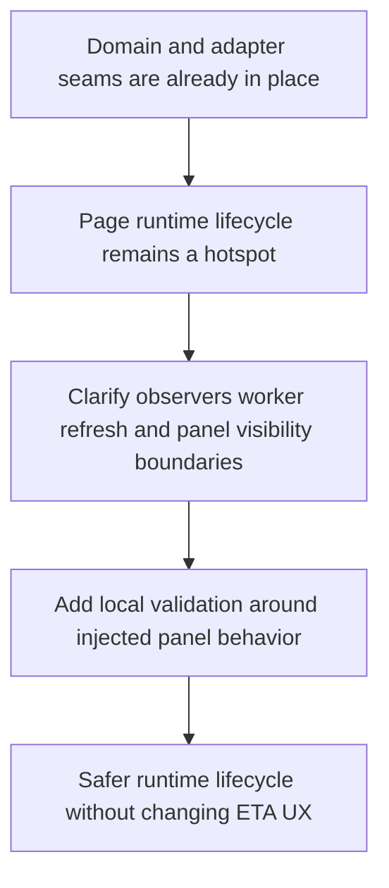

## req_021_harden_page_runtime_lifecycle_and_panel_worker_boundaries - Harden page runtime lifecycle and panel worker boundaries
> From version: 3.0.1
> Status: Done
> Understanding: 100%
> Confidence: 97%
> Complexity: Medium
> Theme: Reliability
> Reminder: Update status/understanding/confidence and references when you edit this doc.

# Needs
- Define a bounded hardening slice around `modules/pages.mjs`, `pages/combatPanel.mjs`, and `pages/nonCombatPanel.mjs`.
- Reduce lifecycle risk around page observers, panel refresh workers, and injected panel visibility without changing the current ETA-panel experience.
- Make the remaining runtime-heavy page behavior safer to validate locally while live Melvor execution is still deferred.

# Context
The project has already stabilized and extracted a large part of its domain, adapter, and orchestration logic.

The main runtime-heavy hotspot that still carries a lot of implicit behavior is now the page and panel lifecycle:
- `modules/pages.mjs` orchestrates observer registration, page matching, worker refresh behavior, and panel visibility
- `pages/combatPanel.mjs` renders and refreshes combat ETA content
- `pages/nonCombatPanel.mjs` renders and refreshes non-combat ETA content across many skills

This area is behaviorally important because it concentrates:
- page-specific runtime matching
- repeated refresh throttling
- injected panel show/hide decisions
- notification and control-panel hooks
- DOM-facing behavior that is hard to reason about when lifecycle boundaries stay implicit

This request is not about redesigning the ETA UI or changing ETA formulas.
It is about hardening the runtime lifecycle boundary around the panels so that:
- worker refresh logic is easier to validate
- panel visibility rules are clearer
- observer and refresh responsibilities are less fragile
- direct local tests can carry more confidence before any later in-game replay

# Acceptance criteria
- A dedicated request is defined around hardening the runtime lifecycle of `modules/pages.mjs`, `pages/combatPanel.mjs`, and `pages/nonCombatPanel.mjs`.
- The request identifies page observers, refresh workers, panel visibility, and notification/control-panel hooks as the main lifecycle hotspots to clarify.
- The request states that current user-facing ETA panel behavior must remain stable unless a later request changes it deliberately.
- The request requires direct local validation for the migrated lifecycle behavior, such as targeted unit tests, fixture-backed checks, DOM-oriented smoke tests, or equivalent automated verification.
- The scope excludes ETA formula redesign, unrelated export-schema changes, and cosmetic UI redesign of panel markup.

# Definition of Ready (DoR)
- [x] Problem statement is explicit and user impact is clear.
- [x] Scope boundaries (in/out) are explicit.
- [x] Acceptance criteria are testable.
- [x] Dependencies and known risks are listed.

# Backlog
- `item_020_harden_page_runtime_lifecycle_and_panel_worker_boundaries`

# Outcome
- The page and panel lifecycle slice landed through `item_020_harden_page_runtime_lifecycle_and_panel_worker_boundaries`.
- `modules/pagesRuntime.mjs` now centralizes worker matching, global-tick gating, control-state transitions, refresh throttling, and shared panel shell markup.
- `modules/pages.mjs`, `pages/combatPanel.mjs`, and `pages/nonCombatPanel.mjs` now rely on these shared helpers for worker/page matching, controls behavior, and refresh timing instead of duplicating that logic inline.
- Local validation now covers the runtime helper and the two panel modules directly without requiring live Melvor execution.
