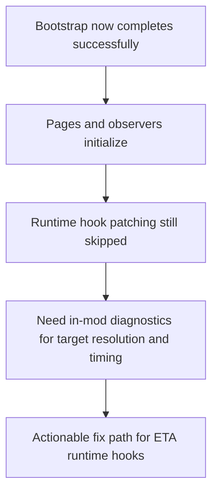

## req_022_diagnose_runtime_patch_target_resolution_for_eta_hooks - Diagnose runtime patch target resolution for ETA hooks
> From version: 3.0.8
> Status: Done
> Understanding: 99%
> Confidence: 99%
> Complexity: Medium
> Theme: Reliability
> Reminder: Update status/understanding/confidence and references when you edit this doc.

# Needs
- Diagnose why ETA runtime hooks in `modules/pages.mjs` are skipped even though the mod lifecycle completes successfully in live Melvor execution.
- Establish a reliable runtime-debugging slice around patch target resolution for gameplay hooks such as `Game.tick`, `CombatManager`, `Player`, `Enemy`, and skill action/stop handlers.
- Preserve the current stabilized bootstrap flow while making the remaining runtime patching failure explicit and actionable.

# Context
Live Melvor logs for `Character Data Exporter (v3.0.8)` now show that:

1. The mod bootstrap completes successfully.
The setup, composition, module loading, character loading, and interface preparation lifecycle all reach their expected completion markers:
- `setup:onModsLoaded:done`
- `setup:onCharacterLoaded:done`
- `setup:onInterfaceReady:done`

2. UI-facing page behavior initializes.
Assets load, page observers register, notification state restores, and the interface reaches the point where ETA panels and controls are wired.

3. Runtime patch hooks are skipped.
During `modules/pages.mjs::worker(ctx)`, the mod logs repeated messages such as:
- `Skipping patch for Game.tick: target class unavailable`
- `Skipping patch for CombatManager.onEnemyDeath: target class unavailable`
- `Skipping patch for Player.damage: target class unavailable`
- `Skipping patch for CraftingSkill.action: target class unavailable`

4. Browser console scope is not the same as the mod runtime scope.
Direct console inspection from the page context reports:
- `globalThis.game === undefined`
- `globalThis.ui === undefined`
- no exposed `mod`, `modManager`, or public `CDE` API object

This means browser-console checks are not sufficient to debug the patching issue directly. The mod must log its own runtime-resolved targets from inside the mod execution context.

The current evidence suggests the problem is not a bootstrap failure anymore. The remaining issue is isolated to runtime patch-target discovery and/or patch timing inside `modules/pages.mjs`.

Potential causes currently considered plausible:
- Melvor runtime classes are not available yet at the time `worker(ctx)` runs.
- Constructor fallback resolution is incomplete for some skills.
- Target methods do not exist on the resolved prototype even when an instance is available.
- Melvor changed the runtime classes or instance graph used by the ETA worker hooks.

This request is not about changing ETA formulas or redesigning page panels.
It is about diagnosing and stabilizing the runtime hook boundary so ETA updates can reliably attach to live Melvor events again.

# Acceptance criteria
- A dedicated request exists for the live-runtime hook resolution issue now isolated after the bootstrap stabilization work.
- The request explicitly states that the mod lifecycle succeeds while runtime hook patch targets still resolve as unavailable.
- The request records that browser-console inspection cannot directly access the same runtime scope as the mod.
- The request requires in-mod diagnostics that log, for each target hook, the discovered global symbol, fallback instance constructor, selected target constructor, and method availability on the prototype.
- The request allows evaluation of delayed or retried patch registration if the primary failure mode is timing-related.
- The request keeps scope limited to diagnosing and stabilizing runtime hook attachment for ETA-related page workers.
- The scope excludes ETA formula changes, export-schema changes, unrelated UI redesign, or unrelated third-party mod conflicts.

# Definition of Ready (DoR)
- [x] Problem statement is explicit and user impact is clear.
- [x] Scope boundaries (in/out) are explicit.
- [x] Acceptance criteria are testable.
- [x] Dependencies and known risks are listed.

# Backlog
- `item_021_diagnose_runtime_patch_target_resolution_for_eta_hooks`

# Outcome
- Pending.
