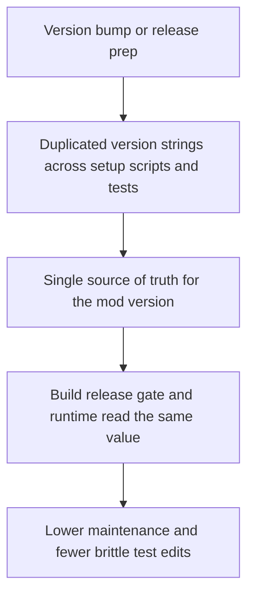

## req_023_centralize_mod_version_source_and_reduce_brittle_version_assertions - Centralize mod version source and reduce brittle version assertions
> From version: 3.0.17
> Status: Done
> Understanding: 100%
> Confidence: 95%
> Complexity: Low
> Theme: Reliability
> Reminder: Update status/understanding/confidence and references when you edit this doc.

# Needs
- Centralize the mod version behind a single source of truth used by runtime code, packaging scripts, and release validation.
- Reduce brittle test maintenance caused by repeating the exact version string across multiple Node test files.
- Preserve the current public behavior: `getVersion()` and export metadata must still expose the same semantic version string.

# Context
The current version flow is mechanically fragile:
- `setup.mjs` owns the version string directly.
- `build.sh` scrapes `setup.mjs` to name the archive.
- `scripts/release_gate.py` also scrapes `setup.mjs`.
- several Node tests hardcode the exact runtime version string.

This means a simple version bump forces multiple unrelated edits and causes low-signal failures in tests that are not actually about versioning behavior.

This slice should keep the release process lightweight while making version management coherent:
- one runtime-owned version source
- build/release tooling aligned on that source
- tests importing the version instead of copying it
- no behavioral change beyond lower maintenance cost and clearer ownership

# Acceptance criteria
- AC1: The mod version is defined in one dedicated source file consumed by runtime code instead of being duplicated in `setup.mjs`.
- AC2: Packaging and release validation read that same dedicated version source when deriving archive expectations.
- AC3: Node tests stop hardcoding the runtime version string where they only need the current exported version value.
- AC4: The updated flow is validated through targeted Node tests, Python release-gate tests, and a build run.

# Definition of Ready (DoR)
- [x] Problem statement is explicit and user impact is clear.
- [x] Scope boundaries (in/out) are explicit.
- [x] Acceptance criteria are testable.
- [x] Dependencies and known risks are listed.

# Backlog
- `item_022_centralize_mod_version_source_and_reduce_brittle_version_assertions`
