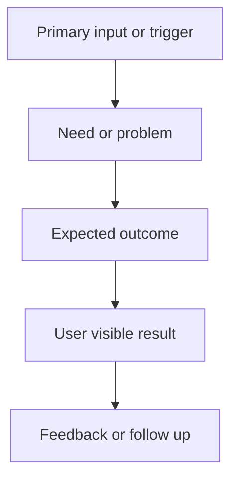

## req_024_fix_eta_level_prediction_labels_and_unknown_shared_notification_display - Fix ETA level prediction labels and unknown shared notification display
> From version: v3.0.17
> Status: Done
> Understanding: 95%
> Confidence: 95%
> Complexity: Low
> Theme: UI
> Reminder: Update status/understanding/confidence and references when you edit this doc.

# Needs
- Fix ETA panels that render XP caps as if they were target levels.
- Prevent stale shared notification rows keyed as `Unknown` from appearing in the panel footer.

# Context
- User-facing ETA panels in non-combat views can show lines such as `to 104273167`, which is an XP cap, not a level.
- The regression comes from prediction objects keyed by XP caps while the panel renders keys as display levels.
- The panel footer can still surface legacy shared notification entries under `Unknown`, even after storage-side sanitization.
- The fix should preserve existing ETA timing calculations and only correct the data shape / rendering contract.

# Acceptance criteria
- AC1: Non-combat skill and mastery prediction rows display target levels such as `110` or `120`, never raw XP cap values.
- AC2: Shared notification display skips invalid legacy keys such as `Unknown`.
- AC3: Targeted ETA, panel, and notification tests cover the regression.

# Definition of Ready (DoR)
- [x] Problem statement is explicit and user impact is clear.
- [x] Scope boundaries (in/out) are explicit.
- [x] Acceptance criteria are testable.
- [x] Dependencies and known risks are listed.

# Backlog
- `item_023_fix_eta_level_prediction_labels_and_unknown_shared_notification_display`
