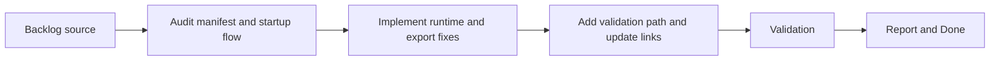

## task_000_stabilize_mod_loading_packaging_and_export_consistency - Stabilize mod loading, packaging, and export consistency
> From version: 2.1.227
> Status: In progress
> Understanding: 94%
> Confidence: 97%
> Progress: 90%
> Complexity: Medium
> Theme: Reliability
> Reminder: Update status/understanding/confidence/progress and dependencies/references when you edit this doc.

# Context
- Derived from backlog item `item_000_stabilize_mod_loading_packaging_and_export_consistency`.
- Source file: `logics/backlog/item_000_stabilize_mod_loading_packaging_and_export_consistency.md`.
- Related request(s): `req_001_stabilize_mod_loading_and_export_consistency`.
- This task covers the first execution slice for project hardening: manifest correctness, startup synchronization, persisted export bootstrap, and the reviewed misleading UI/storage behavior.

# Plan
- [x] 1. Audit the current manifest, startup sequence, export bootstrap, and reviewed UI/storage behaviors; confirm the exact code paths to change for AC1 to AC4.
- [x] 2. Implement the stabilization changes in `manifest.json`, `setup.mjs`, `modules.mjs`, `modules/export.mjs`, and any directly affected UI/storage modules.
- [x] 3. Add or document a lightweight validation path for packaging coherence, startup assumptions, and persisted export bootstrap behavior, then capture the results.
- [x] FINAL: Update related Logics docs

# AC Traceability
- AC1 -> Step 1 and Step 2. Proof: `manifest.json` diff and package coherence validation notes.
- AC2 -> Step 1 and Step 2. Proof: `setup.mjs` and `modules.mjs` diffs plus startup verification notes.
- AC3 -> Step 2. Proof: `modules/export.mjs` diff and persisted export bootstrap verification notes.
- AC4 -> Step 2. Proof: UI/storage module diffs and behavior verification notes.
- AC5 -> Step 3. Proof: validation commands or documented checklist added and executed.

# Links
- Backlog item: `item_000_stabilize_mod_loading_packaging_and_export_consistency`
- Request(s): `req_001_stabilize_mod_loading_and_export_consistency`

# Validation
- `python3 logics/skills/logics-doc-linter/scripts/logics_lint.py`
- `bash build.sh`

# Definition of Done (DoD)
- [ ] Scope implemented and acceptance criteria covered.
- [x] Validation commands executed and results captured.
- [x] Linked request/backlog/task docs updated.
- [ ] Status is `Done` and progress is `100%`.

# Report
- Implemented manifest cleanup:
- removed the invalid `libs/chart.mjs` entry
- added `modules/assetManager.mjs` to the manifest module list
- Implemented startup synchronization:
- `setup.mjs` now awaits module/data/view initialization
- `modules.mjs` now awaits viewer/pages submodule loading
- Implemented persisted export bootstrap fix:
- `modules/export.mjs` now lazy-loads the last saved export from storage when cache is empty
- reset now clears the export cache back to `null`
- Implemented reviewed UI/settings cleanup:
- removed the unused `USE_LZSTRING` setting from the exposed settings surface
- fixed diff button visibility handling in `views/exportView.mjs`
- Added lightweight validation:
- `validate.sh` checks manifest file references and required runtime-loaded modules, then runs `build.sh`
- Validation executed:
- `bash validate.sh`
- `python3 logics/skills/logics-doc-linter/scripts/logics_lint.py`
- Remaining work before closing:
- verify startup and export behavior inside the real Melvor runtime
- then update status/progress and close the task if behavior matches expectations
