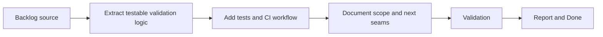

## task_001_improve_testability_testing_and_ci_hardening - Improve testability, testing, and CI hardening
> From version: 2.1.227
> Status: In progress
> Understanding: 94%
> Confidence: 95%
> Progress: 70%
> Complexity: Medium
> Theme: Reliability
> Reminder: Update status/understanding/confidence/progress and dependencies/references when you edit this doc.

# Context
- Derived from backlog item `item_002_improve_testability_testing_and_ci_hardening`.
- Source file: `logics/backlog/item_002_improve_testability_testing_and_ci_hardening.md`.
- Related request(s): `req_003_improve_testability_testing_and_ci_hardening`.
- This first execution slice focuses on extracting a reusable validation seam, adding a minimal project test suite, and wiring a lightweight CI workflow.

# Plan
- [ ] 1. Extract a reusable validation seam from the current project checks so packaging/manifest verification can be executed and tested outside the live game runtime.
- [ ] 2. Add a minimal automated project test suite and CI workflow to run validation, tests, and Logics linting on push and pull request.
- [ ] 3. Record the next high-value seams for future extraction, especially export bootstrap logic and selected ETA calculations.
- [ ] FINAL: Update related Logics docs

# AC Traceability
- AC1 -> Step 1 and Step 3. Proof: extracted validator plus task report of next seams.
- AC2 -> Step 1 and Step 3. Proof: validator extraction and documented future seam list.
- AC3 -> Step 2. Proof: tests, workflow file, and executable validation commands.
- AC4 -> Step 3. Proof: task report explicitly records runtime coupling and lifecycle concerns.
- AC5 -> Step 3. Proof: task report preserves secondary review tracks for later breakdown.

# Links
- Backlog item: `item_002_improve_testability_testing_and_ci_hardening`
- Request(s): `req_003_improve_testability_testing_and_ci_hardening`

# Validation
- `python3 -m unittest discover -s tests -p "test_*.py" -v`
- `bash validate.sh`
- `python3 logics/skills/logics-doc-linter/scripts/logics_lint.py`

# Definition of Done (DoD)
- [ ] Scope implemented and acceptance criteria covered.
- [ ] Validation commands executed and results captured.
- [ ] Linked request/backlog/task docs updated.
- [ ] Status is `Done` and progress is `100%`.

# Report
- Implemented a reusable manifest validator in `scripts/validate_manifest.py`.
- Added unit tests in `tests/test_validate_manifest.py` covering the current repository manifest and a failing synthetic manifest scenario.
- Added a lightweight GitHub Actions workflow in `.github/workflows/validate.yml` to run packaging validation, project tests, and the Logics linter.
- Updated `validate.sh` to reuse the extracted validator instead of embedding validation logic inline.
- Recorded the next extraction targets for later work:
- export bootstrap and history logic in `modules/export.mjs`
- selected pure ETA calculations in `modules/eta.mjs`
- runtime lifecycle assumptions around module/view initialization
- Secondary review tracks preserved for later breakdown:
- stronger type contracts for shared export and ETA payloads
- long-session UI/runtime stability review
