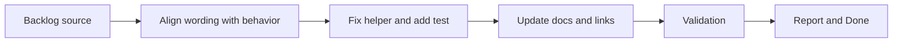

## task_002_align_documentation_and_secondary_api_consistency - Align documentation and secondary API consistency
> From version: 2.1.227
> Status: In progress
> Understanding: 94%
> Confidence: 96%
> Progress: 85%
> Complexity: Low
> Theme: Documentation
> Reminder: Update status/understanding/confidence/progress and dependencies/references when you edit this doc.

# Context
- Derived from backlog item `item_001_align_documentation_and_secondary_api_consistency`.
- Source file: `logics/backlog/item_001_align_documentation_and_secondary_api_consistency.md`.
- Related request(s): `req_002_align_documentation_and_secondary_api_consistency`.
- This execution slice focuses on correcting the compact-output wording, fixing the latent mastery progress helper, and adding a minimal automated check to preserve that correction.

# Plan
- [ ] 1. Align `EXPORT_COMPRESS` wording across settings and user-facing descriptions so it clearly means compact JSON output rather than true payload compression.
- [ ] 2. Correct the latent mastery progress helper and add an automated check to lock the expected behavior.
- [ ] 3. Verify that repository documentation still matches the shipped feature surface after the wording cleanup.
- [ ] FINAL: Update related Logics docs

# AC Traceability
- AC1 -> Step 1 and Step 3. Proof: settings wording and README alignment.
- AC2 -> Step 2. Proof: helper diff and automated test.
- AC3 -> Step 3. Proof: README review/update and validation notes.
- AC4 -> All steps. Proof: changed files stay limited to wording, helper correctness, tests, and workflow links.

# Links
- Backlog item: `item_001_align_documentation_and_secondary_api_consistency`
- Request(s): `req_002_align_documentation_and_secondary_api_consistency`

# Validation
- `node --test tests/test_utils.mjs`
- `python3 logics/skills/logics-doc-linter/scripts/logics_lint.py`
- `bash validate.sh`

# Definition of Done (DoD)
- [ ] Scope implemented and acceptance criteria covered.
- [ ] Validation commands executed and results captured.
- [ ] Linked request/backlog/task docs updated.
- [ ] Status is `Done` and progress is `100%`.

# Report
- Updated the `EXPORT_COMPRESS` setting wording so it describes compact JSON output instead of implying true compression of the exported payload.
- Corrected the formula in `getMasteryProgressPercent()` so progress increases toward the next level instead of decreasing.
- Added `tests/test_utils.mjs` using the native Node test runner to preserve the helper behavior.
- Extended the CI workflow to run the new Node test alongside the existing Python validation tests.
- README remained aligned with the current implementation after the settings wording cleanup.
