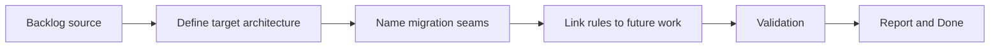

## task_003_prepare_a_clean_architecture_rewrite_after_stabilization - Prepare a clean architecture rewrite after stabilization
> From version: 2.1.227
> Status: Done
> Understanding: 94%
> Confidence: 96%
> Progress: 100%
> Complexity: High
> Theme: Architecture
> Reminder: Update status/understanding/confidence/progress and dependencies/references when you edit this doc.

# Context
- Derived from backlog item `item_003_prepare_a_clean_architecture_rewrite_after_stabilization`.
- Source file: `logics/backlog/item_003_prepare_a_clean_architecture_rewrite_after_stabilization.md`.
- Related request(s): `req_004_prepare_clean_architecture_rewrite_after_stabilization`.
- This task prepares the rewrite path by defining the target architecture, migration sequencing rules, and the seams that should be extracted before any large refactor.

# Plan
- [x] 1. Define the target architecture for a future rewrite with explicit runtime boundaries, domain logic seams, orchestration, and UI layers.
- [x] 2. Record the preferred migration order and the first seams that should be extracted before any broader rewrite decision.
- [x] 3. Link the architecture preparation work back to the stabilized and testable project state so rewrite work stays sequenced behind existing dependencies.
- [x] FINAL: Update related Logics docs

# AC Traceability
- AC1 -> Step 1 and Step 3. Proof: task wording and ADR.
- AC2 -> Step 1. Proof: architecture ADR.
- AC3 -> Step 2. Proof: migration-sequencing section in ADR.
- AC4 -> Step 1 and Step 2. Proof: ADR explicitly preserves existing behavior and contracts.
- AC5 -> Step 3. Proof: links and report reference dependencies on earlier stabilization/testability items.

# Links
- Backlog item: `item_003_prepare_a_clean_architecture_rewrite_after_stabilization`
- Request(s): `req_004_prepare_clean_architecture_rewrite_after_stabilization`
- Architecture note: `adr_000_runtime_boundary_and_rewrite_preparation`

# Validation
- `python3 logics/skills/logics-doc-linter/scripts/logics_lint.py`

# Definition of Done (DoD)
- [x] Scope implemented and acceptance criteria covered.
- [x] Validation commands executed and results captured.
- [x] Linked request/backlog/task docs updated.
- [x] Status is `Done` and progress is `100%`.

# Report
- Added architecture note `logics/architecture/adr_000_runtime_boundary_and_rewrite_preparation.md`.
- Defined the preferred target structure for a future rewrite:
- runtime adapters
- domain logic
- application orchestration
- UI rendering
- Recorded migration sequencing rules:
- no immediate full rewrite
- extract pure logic before replacing runtime-facing modules
- preserve current behavior by default
- keep validation green during each migration slice
- Named the first migration candidates:
- export bootstrap, diff, and changelog history logic
- reusable ETA calculations
- manifest and packaging validation utilities
- settings normalization helpers
- Dependencies remain explicit:
- rewrite work stays behind the stabilization and testability items
