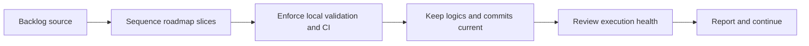

## task_004_orchestrate_incremental_rewrite_execution_governance_and_validation - Orchestrate incremental rewrite execution governance and validation
> From version: 3.0.0
> Status: In progress
> Understanding: 95%
> Confidence: 97%
> Progress: 15%
> Complexity: High
> Theme: Architecture
> Reminder: Update status/understanding/confidence/progress and dependencies/references when you edit this doc.

# Context
- Derived from backlog item `item_015_orchestrate_incremental_rewrite_execution_governance_and_validation`.
- Source file: `logics/backlog/item_015_orchestrate_incremental_rewrite_execution_governance_and_validation.md`.
- Related request(s): `req_016_orchestrate_incremental_rewrite_execution_governance_and_validation`.

# Plan
- [x] 1. Define the active execution order for `item_004` to `item_014`, making explicit which slices can progress now and which should remain gated behind earlier work.
- [ ] 2. Keep local tests, CI, and repository-native validation green for each landed slice, using them as the default confidence path until late live-game verification becomes necessary.
- [ ] 3. Update related `logics` docs and make regular commits as slices progress so roadmap status, dependencies, and delivered work remain reviewable.
- [ ] FINAL: Update related Logics docs

# AC Traceability
- AC1 -> Step 1 and Step 3. Proof: roadmap ordering and linked item status updates.
- AC2 -> Step 2. Proof: validation commands, CI results, and slice-level test evidence.
- AC3 -> Step 3 and FINAL. Proof: updated request/backlog/task docs and commit history.
- AC4 -> Step 1. Proof: tracked execution across linked roadmap items.

# Links
- Backlog item: `item_015_orchestrate_incremental_rewrite_execution_governance_and_validation`
- Request(s): `req_016_orchestrate_incremental_rewrite_execution_governance_and_validation`

# Validation
- `bash validate.sh`
- `python3 logics/skills/logics-doc-linter/scripts/logics_lint.py`
- `python3 -m unittest discover -s tests -p "test_*.py" -v`
- `node --test tests/test_utils.mjs`

# Definition of Done (DoD)
- [ ] Scope implemented and acceptance criteria covered.
- [ ] Validation commands executed and results captured.
- [ ] Linked request/backlog/task docs updated.
- [ ] Status is `Done` and progress is `100%`.

# Report
- This task orchestrates execution across the rewrite roadmap instead of implementing a single feature slice.
- Default validation path before late in-game verification:
- local tests
- CI
- repository-native validation commands
- Execution hygiene expected on every slice:
- update `logics` docs when status or sequencing changes
- commit regularly in reviewable increments
- keep individual slice scope inside its own backlog item
- Active execution state:
- `task_005_extract_export_domain_logic_behind_runtime_adapters` is implemented and locally validated
- subsequent slices remain gated behind the same local validation and commit discipline
