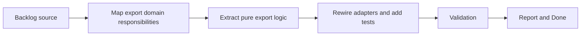

## task_005_extract_export_domain_logic_behind_runtime_adapters - Extract export domain logic behind runtime adapters
> From version: 3.0.0
> Status: Ready
> Understanding: 95%
> Confidence: 97%
> Progress: 0%
> Complexity: Medium
> Theme: Architecture
> Reminder: Update status/understanding/confidence/progress and dependencies/references when you edit this doc.

# Context
- Derived from backlog item `item_004_extract_export_domain_logic_behind_runtime_adapters`.
- Source file: `logics/backlog/item_004_extract_export_domain_logic_behind_runtime_adapters.md`.
- Related request(s): `req_005_extract_export_domain_logic_behind_runtime_adapters`.

# Plan
- [ ] 1. Audit the current export flow in `modules/export.mjs`, `modules/localStorage.mjs`, `modules/cloudStorage.mjs`, and `modules/viewer.mjs`, then define the exact bootstrap, diff, and history rules that should move into a pure export-domain seam.
- [ ] 2. Extract that pure export-domain logic into a dedicated testable module, keeping storage access, sharing, downloads, clipboard, and UI side effects behind adapters or orchestration code.
- [ ] 3. Rewire the existing export modules onto the extracted seam and add focused tests for bootstrap, diff generation, history retention, and preserved payload behavior.
- [ ] FINAL: Update related Logics docs

# AC Traceability
- AC1 -> Step 1 and Step 2. Proof: extracted export-domain module and updated responsibility boundaries.
- AC2 -> Step 2 and Step 3. Proof: preserved export behavior plus local tests and CI-compatible validation.
- AC3 -> FINAL. Proof: updated request/backlog/task docs and regular commits captured during execution.

# Links
- Backlog item: `item_004_extract_export_domain_logic_behind_runtime_adapters`
- Request(s): `req_005_extract_export_domain_logic_behind_runtime_adapters`
- Orchestration task: `task_004_orchestrate_incremental_rewrite_execution_governance_and_validation`

# Validation
- `bash validate.sh`
- `python3 logics/skills/logics-doc-linter/scripts/logics_lint.py`
- `python3 -m unittest discover -s tests -p "test_*.py" -v`
- `node --test tests/test_utils.mjs`
- run the new export-domain test file added by this slice

# Definition of Done (DoD)
- [ ] Scope implemented and acceptance criteria covered.
- [ ] Validation commands executed and results captured.
- [ ] Linked request/backlog/task docs updated.
- [ ] Status is `Done` and progress is `100%`.

# Report
- Target seam for this task:
- persisted export bootstrap
- export diff generation
- changes history retention and trimming
- side effects that must stay outside the seam:
- local and cloud storage access
- clipboard, download, and share flows
- modal and viewer behavior
- Main expected touch points:
- `modules/export.mjs`
- `modules/localStorage.mjs`
- `modules/cloudStorage.mjs`
- `modules/viewer.mjs`
- new testable export-domain module and tests
