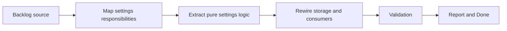

## task_006_extract_settings_domain_logic_behind_storage_adapters - Extract settings domain logic behind storage adapters
> From version: 3.0.0
> Status: Done
> Understanding: 95%
> Confidence: 97%
> Progress: 100%
> Complexity: Medium
> Theme: Architecture
> Reminder: Update status/understanding/confidence/progress and dependencies/references when you edit this doc.

# Context
- Derived from backlog item `item_005_extract_settings_domain_logic_behind_storage_adapters`.
- Source file: `logics/backlog/item_005_extract_settings_domain_logic_behind_storage_adapters.md`.
- Related request(s): `req_006_extract_settings_domain_logic_behind_storage_adapters`.

# Plan
- [x] 1. Audit the current settings flow in `modules/settings.mjs`, `modules/localStorage.mjs`, `modules/cloudStorage.mjs`, `setup.mjs`, and selected consumers to identify defaults, normalization, validation, and interpretation rules.
- [x] 2. Extract a pure settings-domain module that owns canonical definitions, defaults, normalization, and interpretation while keeping storage and UI side effects outside the seam.
- [x] 3. Rewire current settings consumers onto the extracted seam and add focused tests for defaults, merge behavior, normalization, and preserved visible behavior.
- [x] FINAL: Update related Logics docs

# AC Traceability
- AC1 -> Step 1 and Step 2. Proof: extracted settings-domain module and clarified responsibilities.
- AC2 -> Step 2 and Step 3. Proof: preserved visible settings behavior and local tests.
- AC3 -> FINAL. Proof: updated `logics` docs and regular commits.

# Links
- Backlog item: `item_005_extract_settings_domain_logic_behind_storage_adapters`
- Request(s): `req_006_extract_settings_domain_logic_behind_storage_adapters`
- Orchestration task: `task_004_orchestrate_incremental_rewrite_execution_governance_and_validation`

# Validation
- `bash validate.sh`
- `python3 logics/skills/logics-doc-linter/scripts/logics_lint.py`
- `python3 -m unittest discover -s tests -p "test_*.py" -v`
- `node --test tests/test_utils.mjs`
- run the new settings-domain test file added by this slice

# Definition of Done (DoD)
- [x] Scope implemented and acceptance criteria covered.
- [x] Validation commands executed and results captured.
- [x] Linked request/backlog/task docs updated.
- [x] Status is `Done` and progress is `100%`.

# Report
- Target seam for this task:
- settings defaults
- settings normalization
- settings interpretation helpers
- Side effects that must stay outside the seam:
- storage reads and writes
- settings UI rendering
- startup orchestration calls
- Delivered files:
- `modules/settingsDomain.mjs`
- `modules/settings.mjs`
- `modules/cloudStorage.mjs`
- `modules.mjs`
- `manifest.json`
- `tests/test_settings_domain.mjs`
- `.github/workflows/validate.yml`
- Validation executed:
- `node --test tests/test_utils.mjs tests/test_export_domain.mjs tests/test_settings_domain.mjs`
- `python3 -m unittest discover -s tests -p "test_*.py" -v`
- `bash validate.sh`
- `python3 logics/skills/logics-doc-linter/scripts/logics_lint.py`
