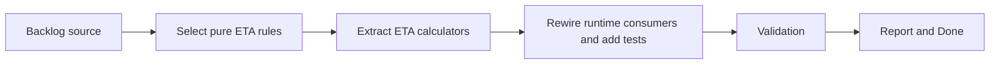

## task_007_extract_selected_eta_calculations_behind_runtime_adapters - Extract selected ETA calculations behind runtime adapters
> From version: 3.0.0
> Status: Ready
> Understanding: 94%
> Confidence: 96%
> Progress: 0%
> Complexity: High
> Theme: Architecture
> Reminder: Update status/understanding/confidence/progress and dependencies/references when you edit this doc.

# Context
- Derived from backlog item `item_006_extract_selected_eta_calculations_behind_runtime_adapters`.
- Source file: `logics/backlog/item_006_extract_selected_eta_calculations_behind_runtime_adapters.md`.
- Related request(s): `req_007_extract_selected_eta_calculations_behind_runtime_adapters`.

# Plan
- [ ] 1. Audit `modules/eta.mjs`, `modules/pages.mjs`, `modules/collector.mjs`, and supporting helpers to identify ETA rules that can become pure calculations without taking runtime hooks or UI refresh logic with them.
- [ ] 2. Extract those calculations into a dedicated ETA-domain module with normalized inputs and outputs, leaving runtime observation and panel refresh behavior outside the seam.
- [ ] 3. Rewire ETA consumers onto the extracted seam and add focused tests for rates, durations, summaries, and preserved ETA outputs.
- [ ] FINAL: Update related Logics docs

# AC Traceability
- AC1 -> Step 1 and Step 2. Proof: selected pure ETA calculations extracted into a domain module.
- AC2 -> Step 2 and Step 3. Proof: preserved ETA outputs and local tests.
- AC3 -> FINAL. Proof: updated `logics` docs and regular commits.

# Links
- Backlog item: `item_006_extract_selected_eta_calculations_behind_runtime_adapters`
- Request(s): `req_007_extract_selected_eta_calculations_behind_runtime_adapters`
- Orchestration task: `task_004_orchestrate_incremental_rewrite_execution_governance_and_validation`

# Validation
- `bash validate.sh`
- `python3 logics/skills/logics-doc-linter/scripts/logics_lint.py`
- `python3 -m unittest discover -s tests -p "test_*.py" -v`
- `node --test tests/test_utils.mjs`
- run the new ETA-domain test file added by this slice

# Definition of Done (DoD)
- [ ] Scope implemented and acceptance criteria covered.
- [ ] Validation commands executed and results captured.
- [ ] Linked request/backlog/task docs updated.
- [ ] Status is `Done` and progress is `100%`.

# Report
- Target seam for this task:
- pure duration and rate calculations
- ETA summaries derived from normalized inputs
- Runtime concerns that must stay outside the seam:
- page observers
- patch hooks
- UI refresh timing
