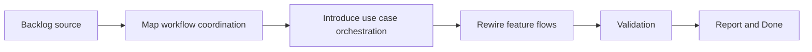

## task_008_define_application_orchestration_between_domain_and_runtime_adapters - Define application orchestration between domain and runtime adapters
> From version: 3.0.0
> Status: Ready
> Understanding: 94%
> Confidence: 96%
> Progress: 0%
> Complexity: High
> Theme: Architecture
> Reminder: Update status/understanding/confidence/progress and dependencies/references when you edit this doc.

# Context
- Derived from backlog item `item_007_define_application_orchestration_between_domain_and_runtime_adapters`.
- Source file: `logics/backlog/item_007_define_application_orchestration_between_domain_and_runtime_adapters.md`.
- Related request(s): `req_008_define_application_orchestration_between_domain_and_runtime_adapters`.

# Plan
- [ ] 1. Audit current workflow coordination in `setup.mjs`, `modules.mjs`, and key runtime-facing feature modules to identify where startup, export, settings, and ETA use cases are still implicit.
- [ ] 2. Introduce application-orchestration modules or use cases that coordinate domain logic and adapters without owning low-level runtime APIs or direct UI rendering.
- [ ] 3. Rewire the main flows onto those orchestrators and add focused validation for startup sequencing and core feature flows.
- [ ] FINAL: Update related Logics docs

# AC Traceability
- AC1 -> Step 1 and Step 2. Proof: explicit orchestration responsibilities and modules.
- AC2 -> Step 2 and Step 3. Proof: preserved startup and feature flows with local validation.
- AC3 -> FINAL. Proof: updated `logics` docs and regular commits.

# Links
- Backlog item: `item_007_define_application_orchestration_between_domain_and_runtime_adapters`
- Request(s): `req_008_define_application_orchestration_between_domain_and_runtime_adapters`
- Orchestration task: `task_004_orchestrate_incremental_rewrite_execution_governance_and_validation`

# Validation
- `bash validate.sh`
- `python3 logics/skills/logics-doc-linter/scripts/logics_lint.py`
- `python3 -m unittest discover -s tests -p "test_*.py" -v`
- `node --test tests/test_utils.mjs`
- run the new orchestration-focused test file or smoke checks added by this slice

# Definition of Done (DoD)
- [ ] Scope implemented and acceptance criteria covered.
- [ ] Validation commands executed and results captured.
- [ ] Linked request/backlog/task docs updated.
- [ ] Status is `Done` and progress is `100%`.

# Report
- Target seam for this task:
- startup use cases
- export flow coordination
- settings application flow
- ETA trigger coordination
