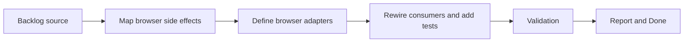

## task_009_normalize_browser_facing_runtime_adapters - Normalize browser facing runtime adapters
> From version: 3.0.0
> Status: Done
> Understanding: 97%
> Confidence: 98%
> Progress: 100%
> Complexity: Medium
> Theme: Architecture
> Reminder: Update status/understanding/confidence/progress and dependencies/references when you edit this doc.

# Context
- Derived from backlog item `item_008_normalize_melvor_and_browser_runtime_adapters`.
- Source file: `logics/backlog/item_008_normalize_melvor_and_browser_runtime_adapters.md`.
- Related request(s): `req_009_normalize_melvor_and_browser_runtime_adapters`.

# Plan
- [x] 1. Audit browser-facing side effects such as clipboard, downloads, notifications, and browser storage access across viewer and storage modules.
- [x] 2. Introduce explicit browser-facing adapters for those side effects while preserving current user-visible behavior.
- [x] 3. Rewire consumers onto those adapters and add focused tests or smoke checks for adapter contracts and fallback behavior.
- [x] FINAL: Update related Logics docs

# AC Traceability
- AC1 -> Step 1 and Step 2. Proof: explicit browser-facing adapter contracts.
- AC2 -> Step 2 and Step 3. Proof: preserved side effects with local validation.
- AC3 -> FINAL. Proof: updated `logics` docs and regular commits.

# Links
- Backlog item: `item_008_normalize_melvor_and_browser_runtime_adapters`
- Request(s): `req_009_normalize_melvor_and_browser_runtime_adapters`
- Orchestration task: `task_004_orchestrate_incremental_rewrite_execution_governance_and_validation`

# Validation
- `bash validate.sh`
- `python3 logics/skills/logics-doc-linter/scripts/logics_lint.py`
- `python3 -m unittest discover -s tests -p "test_*.py" -v`
- `node --test tests/test_utils.mjs tests/test_export_domain.mjs tests/test_settings_domain.mjs tests/test_eta_domain.mjs tests/test_app_orchestrator.mjs tests/test_browser_runtime.mjs`
- run the new browser-adapter test file added by this slice

# Definition of Done (DoD)
- [x] Scope implemented and acceptance criteria covered.
- [x] Validation commands executed and results captured.
- [x] Linked request/backlog/task docs updated.
- [x] Status is `Done` and progress is `100%`.

# Report
- Extracted `modules/browserRuntime.mjs` as the explicit browser-side adapter for modal display, clipboard, downloads, native notification permission, native notifications, and `localStorage` access.
- Rewired `modules/viewer.mjs`, `modules/localStorage.mjs`, `modules/notification.mjs`, `views/exportView.mjs`, and `views/changelogView.mjs` onto the adapter while preserving visible behavior.
- Added `tests/test_browser_runtime.mjs` to validate adapter behavior for modal, clipboard, download, storage, and notification contracts.
- Validation executed:
- `node --test tests/test_utils.mjs tests/test_export_domain.mjs tests/test_settings_domain.mjs tests/test_eta_domain.mjs tests/test_app_orchestrator.mjs tests/test_browser_runtime.mjs`
- `python3 -m unittest discover -s tests -p "test_*.py" -v`
- `bash validate.sh`
- `python3 logics/skills/logics-doc-linter/scripts/logics_lint.py`
- `python3 logics/skills/logics-flow-manager/scripts/workflow_audit.py`
