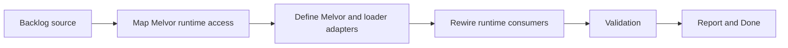

## task_010_normalize_melvor_runtime_and_loader_adapters - Normalize Melvor runtime and loader adapters
> From version: 3.0.0
> Status: Ready
> Understanding: 93%
> Confidence: 95%
> Progress: 0%
> Complexity: Medium
> Theme: Architecture
> Reminder: Update status/understanding/confidence/progress and dependencies/references when you edit this doc.

# Context
- Derived from backlog item `item_008_normalize_melvor_and_browser_runtime_adapters`.
- Source file: `logics/backlog/item_008_normalize_melvor_and_browser_runtime_adapters.md`.
- Related request(s): `req_009_normalize_melvor_and_browser_runtime_adapters`.

# Plan
- [ ] 1. Audit direct Melvor runtime and loader access such as `game`, `ui`, `Swal`, hooks, and patch APIs across setup, pages, viewer, and feature modules.
- [ ] 2. Introduce explicit Melvor runtime and loader adapters that narrow ownership of those accesses.
- [ ] 3. Rewire consumers onto the adapters and add focused smoke checks or tests for the new runtime contracts.
- [ ] FINAL: Update related Logics docs

# AC Traceability
- AC1 -> Step 1 and Step 2. Proof: explicit Melvor runtime and loader adapter boundaries.
- AC2 -> Step 2 and Step 3. Proof: preserved side effects and local validation.
- AC3 -> FINAL. Proof: updated `logics` docs and regular commits.

# Links
- Backlog item: `item_008_normalize_melvor_and_browser_runtime_adapters`
- Request(s): `req_009_normalize_melvor_and_browser_runtime_adapters`
- Orchestration task: `task_004_orchestrate_incremental_rewrite_execution_governance_and_validation`

# Validation
- `bash validate.sh`
- `python3 logics/skills/logics-doc-linter/scripts/logics_lint.py`
- `python3 -m unittest discover -s tests -p "test_*.py" -v`
- `node --test tests/test_utils.mjs`
- run the new Melvor-adapter test or smoke-check file added by this slice

# Definition of Done (DoD)
- [ ] Scope implemented and acceptance criteria covered.
- [ ] Validation commands executed and results captured.
- [ ] Linked request/backlog/task docs updated.
- [ ] Status is `Done` and progress is `100%`.

# Report
- Melvor-facing concerns in scope:
- game reads
- ui and modal services
- loader hooks
- patch APIs
