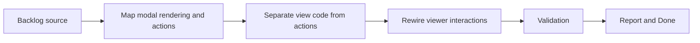

## task_011_separate_modal_rendering_from_viewer_actions - Separate modal rendering from viewer actions
> From version: 3.0.0
> Status: Done
> Understanding: 96%
> Confidence: 97%
> Progress: 100%
> Complexity: Medium
> Theme: Architecture
> Reminder: Update status/understanding/confidence/progress and dependencies/references when you edit this doc.

# Context
- Derived from backlog item `item_009_establish_a_ui_rendering_boundary_for_injected_views_and_panels`.
- Source file: `logics/backlog/item_009_establish_a_ui_rendering_boundary_for_injected_views_and_panels.md`.
- Related request(s): `req_010_establish_a_ui_rendering_boundary_for_injected_views_and_panels`.

# Plan
- [x] 1. Audit `views/exportView.mjs`, `views/changelogView.mjs`, and `modules/viewer.mjs` to identify rendering responsibilities versus action and flow responsibilities.
- [x] 2. Separate modal rendering logic from viewer-triggered actions while preserving current modal behavior.
- [x] 3. Rewire modal interactions onto the cleaner boundary and add focused checks for modal rendering and action dispatch.
- [x] FINAL: Update related Logics docs

# AC Traceability
- AC1 -> Step 1 and Step 2. Proof: clearer modal boundary between rendering and actions.
- AC2 -> Step 2 and Step 3. Proof: preserved modal behavior and focused validation.
- AC3 -> FINAL. Proof: updated `logics` docs and regular commits.

# Links
- Backlog item: `item_009_establish_a_ui_rendering_boundary_for_injected_views_and_panels`
- Request(s): `req_010_establish_a_ui_rendering_boundary_for_injected_views_and_panels`
- Orchestration task: `task_004_orchestrate_incremental_rewrite_execution_governance_and_validation`

# Validation
- `bash validate.sh`
- `python3 logics/skills/logics-doc-linter/scripts/logics_lint.py`
- `python3 -m unittest discover -s tests -p "test_*.py" -v`
- `node --test tests/test_utils.mjs tests/test_export_domain.mjs tests/test_settings_domain.mjs tests/test_eta_domain.mjs tests/test_app_orchestrator.mjs tests/test_browser_runtime.mjs tests/test_melvor_runtime.mjs tests/test_viewer_actions.mjs`
- run the new modal-boundary test or smoke-check file added by this slice

# Definition of Done (DoD)
- [x] Scope implemented and acceptance criteria covered.
- [x] Validation commands executed and results captured.
- [x] Linked request/backlog/task docs updated.
- [x] Status is `Done` and progress is `100%`.

# Report
- Extracted `modules/viewerActions.mjs` to own export-modal and changelog-modal actions such as reset, refresh, download, clipboard, Hastebin, and changelog export flows.
- Rewired `views/exportView.mjs` and `views/changelogView.mjs` to focus on modal rendering and DOM event binding while delegating actions to `viewerActions`.
- Added `tests/test_viewer_actions.mjs` to validate action dispatch independently from modal rendering.
- Validation executed:
- `node --test tests/test_utils.mjs tests/test_export_domain.mjs tests/test_settings_domain.mjs tests/test_eta_domain.mjs tests/test_app_orchestrator.mjs tests/test_browser_runtime.mjs tests/test_melvor_runtime.mjs tests/test_viewer_actions.mjs`
- `python3 -m unittest discover -s tests -p "test_*.py" -v`
- `bash validate.sh`
- `python3 logics/skills/logics-doc-linter/scripts/logics_lint.py`
- `python3 logics/skills/logics-flow-manager/scripts/workflow_audit.py`
