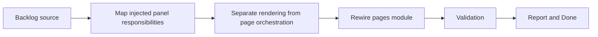

## task_012_isolate_injected_panel_rendering_from_page_orchestration - Isolate injected panel rendering from page orchestration
> From version: 3.0.0
> Status: Done
> Understanding: 96%
> Confidence: 97%
> Progress: 100%
> Complexity: Medium
> Theme: Architecture
> Reminder: Update status/understanding/confidence/progress and dependencies/references when you edit this doc.

# Context
- Derived from backlog item `item_009_establish_a_ui_rendering_boundary_for_injected_views_and_panels`.
- Source file: `logics/backlog/item_009_establish_a_ui_rendering_boundary_for_injected_views_and_panels.md`.
- Related request(s): `req_010_establish_a_ui_rendering_boundary_for_injected_views_and_panels`.

# Plan
- [x] 1. Audit `modules/pages.mjs` and related render paths to distinguish panel rendering and update code from observers, hooks, and page orchestration.
- [x] 2. Separate injected panel rendering from page orchestration while preserving current panel behavior.
- [x] 3. Rewire page integration onto the new boundary and add focused checks for rendering and page lifecycle behavior.
- [x] FINAL: Update related Logics docs

# AC Traceability
- AC1 -> Step 1 and Step 2. Proof: clearer injected-panel rendering boundary.
- AC2 -> Step 2 and Step 3. Proof: preserved panel behavior and focused validation.
- AC3 -> FINAL. Proof: updated `logics` docs and regular commits.

# Links
- Backlog item: `item_009_establish_a_ui_rendering_boundary_for_injected_views_and_panels`
- Request(s): `req_010_establish_a_ui_rendering_boundary_for_injected_views_and_panels`
- Orchestration task: `task_004_orchestrate_incremental_rewrite_execution_governance_and_validation`

# Validation
- `bash validate.sh`
- `python3 logics/skills/logics-doc-linter/scripts/logics_lint.py`
- `python3 -m unittest discover -s tests -p "test_*.py" -v`
- `node --test tests/test_utils.mjs tests/test_export_domain.mjs tests/test_settings_domain.mjs tests/test_eta_domain.mjs tests/test_app_orchestrator.mjs tests/test_browser_runtime.mjs tests/test_melvor_runtime.mjs tests/test_viewer_actions.mjs tests/test_panel_renderer.mjs`
- run the new panel-boundary test or smoke-check file added by this slice

# Definition of Done (DoD)
- [x] Scope implemented and acceptance criteria covered.
- [x] Validation commands executed and results captured.
- [x] Linked request/backlog/task docs updated.
- [x] Status is `Done` and progress is `100%`.

# Report
- Extracted `modules/panelRenderer.mjs` to own injected ETA panel creation, insertion, positioning, and removal.
- Rewired `modules/pages.mjs` to keep observers, hooks, and page lifecycle orchestration while delegating DOM panel injection to `panelRenderer`.
- Added `tests/test_panel_renderer.mjs` to validate injected panel creation, placement, alignment, and removal without relying on the live game runtime.
- Validation executed:
- `node --test tests/test_utils.mjs tests/test_export_domain.mjs tests/test_settings_domain.mjs tests/test_eta_domain.mjs tests/test_app_orchestrator.mjs tests/test_browser_runtime.mjs tests/test_melvor_runtime.mjs tests/test_viewer_actions.mjs tests/test_panel_renderer.mjs`
- `python3 -m unittest discover -s tests -p "test_*.py" -v`
- `bash validate.sh`
- `python3 logics/skills/logics-doc-linter/scripts/logics_lint.py`
- `python3 logics/skills/logics-flow-manager/scripts/workflow_audit.py`
