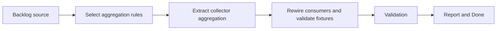

## task_014_extract_collector_aggregation_behind_collection_adapters - Extract collector aggregation behind collection adapters
> From version: 3.0.0
> Status: Done
> Understanding: 96%
> Confidence: 97%
> Progress: 100%
> Complexity: High
> Theme: Architecture
> Reminder: Update status/understanding/confidence/progress and dependencies/references when you edit this doc.

# Context
- Derived from backlog item `item_010_isolate_collector_logic_behind_runtime_collection_adapters`.
- Source file: `logics/backlog/item_010_isolate_collector_logic_behind_runtime_collection_adapters.md`.
- Related request(s): `req_011_isolate_collector_logic_behind_runtime_collection_adapters`.

# Plan
- [x] 1. Use the boundaries and fixtures from the preceding collector task to select the aggregation rules that can move behind collection adapters without changing export coverage.
- [x] 2. Extract collector aggregation logic into a cleaner seam while leaving raw runtime collection access behind explicit adapters.
- [x] 3. Rewire collector consumers onto the seam and validate the preserved output through fixtures or equivalent controlled checks.
- [x] FINAL: Update related Logics docs

# AC Traceability
- AC1 -> Step 1 and Step 2. Proof: collector aggregation is separated from runtime collection access.
- AC2 -> Step 2 and Step 3. Proof: preserved export coverage and fixture-based validation.
- AC3 -> FINAL. Proof: updated `logics` docs and regular commits.

# Links
- Backlog item: `item_010_isolate_collector_logic_behind_runtime_collection_adapters`
- Request(s): `req_011_isolate_collector_logic_behind_runtime_collection_adapters`
- Orchestration task: `task_004_orchestrate_incremental_rewrite_execution_governance_and_validation`

# Validation
- `bash validate.sh`
- `python3 logics/skills/logics-doc-linter/scripts/logics_lint.py`
- `python3 -m unittest discover -s tests -p "test_*.py" -v`
- `node --test tests/test_utils.mjs tests/test_export_domain.mjs tests/test_settings_domain.mjs tests/test_eta_domain.mjs tests/test_app_orchestrator.mjs tests/test_browser_runtime.mjs tests/test_melvor_runtime.mjs tests/test_viewer_actions.mjs tests/test_panel_renderer.mjs tests/test_collector_adapter.mjs tests/test_collector_domain.mjs`

# Definition of Done (DoD)
- [x] Scope implemented and acceptance criteria covered.
- [x] Validation commands executed and results captured.
- [x] Linked request/backlog/task docs updated.
- [x] Status is `Done` and progress is `100%`.

# Report
- This task depends on the fixture and boundary work from `task_013_define_collector_adapter_fixtures_and_boundaries`.
- Selected the simple, high-signal collectors where runtime access and export-shape assembly could be split safely without touching `collectCurrentActivity`: basics, skills, mastery, agility, and active potions.
- Added `modules/collectorDomain.mjs` to hold pure aggregation rules for those sections while leaving live Melvor reads inside `modules/collector.mjs`.
- Rewired `modules/collector.mjs` to pass raw runtime values into `collectorDomain`, reducing embedded export-shape assembly in the runtime-heavy collector module.
- Added `tests/test_collector_domain.mjs` to validate the extracted aggregation logic against controlled fixtures and preserve the existing export payload shape.
- Validation executed:
- `node --test tests/test_utils.mjs tests/test_export_domain.mjs tests/test_settings_domain.mjs tests/test_eta_domain.mjs tests/test_app_orchestrator.mjs tests/test_browser_runtime.mjs tests/test_melvor_runtime.mjs tests/test_viewer_actions.mjs tests/test_panel_renderer.mjs tests/test_collector_adapter.mjs tests/test_collector_domain.mjs`
- `python3 -m unittest discover -s tests -p "test_*.py" -v`
- `bash validate.sh`
