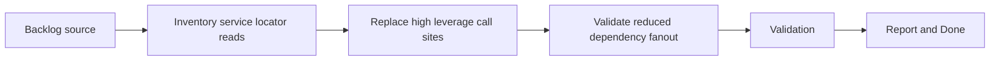

## task_015_reduce_service_locator_reads_in_feature_modules - Reduce service locator reads in feature modules
> From version: 3.0.0
> Status: Ready
> Understanding: 92%
> Confidence: 94%
> Progress: 0%
> Complexity: Medium
> Theme: Architecture
> Reminder: Update status/understanding/confidence/progress and dependencies/references when you edit this doc.

# Context
- Derived from backlog item `item_011_converge_on_an_explicit_composition_root_and_reduce_the_global_module_manager`.
- Source file: `logics/backlog/item_011_converge_on_an_explicit_composition_root_and_reduce_the_global_module_manager.md`.
- Related request(s): `req_012_converge_on_an_explicit_composition_root_and_reduce_the_global_module_manager`.

# Plan
- [ ] 1. Audit feature modules for broad `mods.get...` or equivalent service-locator reads that should be replaced by clearer dependency boundaries first.
- [ ] 2. Replace the highest-leverage call sites with explicit injected dependencies or orchestrated access paths without changing behavior.
- [ ] 3. Validate the reduced dependency fanout through local checks and document the remaining service-locator hotspots before the composition-root task.
- [ ] FINAL: Update related Logics docs

# AC Traceability
- AC1 -> Step 1 and Step 2. Proof: reduced service-locator usage in feature modules.
- AC2 -> Step 2 and Step 3. Proof: preserved startup and feature behavior with local validation.
- AC3 -> FINAL. Proof: updated `logics` docs and regular commits.

# Links
- Backlog item: `item_011_converge_on_an_explicit_composition_root_and_reduce_the_global_module_manager`
- Request(s): `req_012_converge_on_an_explicit_composition_root_and_reduce_the_global_module_manager`
- Orchestration task: `task_004_orchestrate_incremental_rewrite_execution_governance_and_validation`

# Validation
- `bash validate.sh`
- `python3 logics/skills/logics-doc-linter/scripts/logics_lint.py`
- `python3 -m unittest discover -s tests -p "test_*.py" -v`
- `node --test tests/test_utils.mjs`
- run any new dependency-fanout smoke checks added by this slice

# Definition of Done (DoD)
- [ ] Scope implemented and acceptance criteria covered.
- [ ] Validation commands executed and results captured.
- [ ] Linked request/backlog/task docs updated.
- [ ] Status is `Done` and progress is `100%`.

# Report
- This task prepares the composition-root work by shrinking the hidden dependency graph first.
