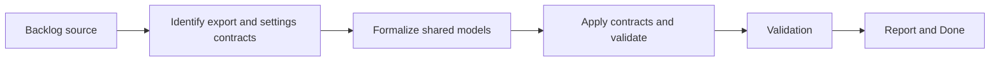

## task_017_formalize_export_and_settings_contracts - Formalize export and settings contracts
> From version: 3.0.0
> Status: Ready
> Understanding: 92%
> Confidence: 94%
> Progress: 0%
> Complexity: Medium
> Theme: Architecture
> Reminder: Update status/understanding/confidence/progress and dependencies/references when you edit this doc.

# Context
- Derived from backlog item `item_012_formalize_shared_contracts_and_strengthen_type_checked_data_models`.
- Source file: `logics/backlog/item_012_formalize_shared_contracts_and_strengthen_type_checked_data_models.md`.
- Related request(s): `req_013_formalize_shared_contracts_and_strengthen_type_checked_data_models`.

# Plan
- [ ] 1. Identify the highest-value shared contract shapes for export payloads, export history or diff records, and settings definitions or normalized values.
- [ ] 2. Formalize those contracts using type-checked models compatible with the current codebase.
- [ ] 3. Apply the contracts to key modules and tests, then add structural validation alongside existing behavior checks.
- [ ] FINAL: Update related Logics docs

# AC Traceability
- AC1 -> Step 1 and Step 2. Proof: explicit export and settings contracts.
- AC2 -> Step 2 and Step 3. Proof: stronger structural expectations without behavior changes.
- AC3 -> FINAL. Proof: updated `logics` docs and regular commits.

# Links
- Backlog item: `item_012_formalize_shared_contracts_and_strengthen_type_checked_data_models`
- Request(s): `req_013_formalize_shared_contracts_and_strengthen_type_checked_data_models`
- Orchestration task: `task_004_orchestrate_incremental_rewrite_execution_governance_and_validation`

# Validation
- `bash validate.sh`
- `python3 logics/skills/logics-doc-linter/scripts/logics_lint.py`
- `python3 -m unittest discover -s tests -p "test_*.py" -v`
- `node --test tests/test_utils.mjs`
- run the new contract-validation tests added by this slice

# Definition of Done (DoD)
- [ ] Scope implemented and acceptance criteria covered.
- [ ] Validation commands executed and results captured.
- [ ] Linked request/backlog/task docs updated.
- [ ] Status is `Done` and progress is `100%`.

# Report
- Contract families in scope:
- export payloads
- export diff or history records
- settings definitions and normalized values
