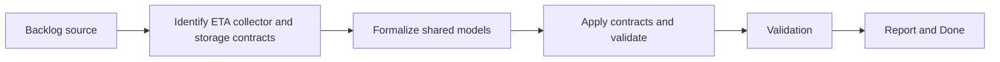

## task_018_formalize_eta_collector_and_storage_contracts - Formalize ETA collector and storage contracts
> From version: 3.0.0
> Status: Done
> Understanding: 96%
> Confidence: 97%
> Progress: 100%
> Complexity: Medium
> Theme: Architecture
> Reminder: Update status/understanding/confidence/progress and dependencies/references when you edit this doc.

# Context
- Derived from backlog item `item_012_formalize_shared_contracts_and_strengthen_type_checked_data_models`.
- Source file: `logics/backlog/item_012_formalize_shared_contracts_and_strengthen_type_checked_data_models.md`.
- Related request(s): `req_013_formalize_shared_contracts_and_strengthen_type_checked_data_models`.

# Plan
- [x] 1. Identify the highest-value shared contract shapes for ETA inputs or outputs, collector records, and storage records.
- [x] 2. Formalize those contracts using type-checked models compatible with the current codebase.
- [x] 3. Apply the contracts to key modules and tests, then add structural validation alongside existing behavior checks.
- [x] FINAL: Update related Logics docs

# AC Traceability
- AC1 -> Step 1 and Step 2. Proof: explicit ETA, collector, and storage contracts.
- AC2 -> Step 2 and Step 3. Proof: stronger structural expectations without behavior changes.
- AC3 -> FINAL. Proof: updated `logics` docs and regular commits.

# Links
- Backlog item: `item_012_formalize_shared_contracts_and_strengthen_type_checked_data_models`
- Request(s): `req_013_formalize_shared_contracts_and_strengthen_type_checked_data_models`
- Orchestration task: `task_004_orchestrate_incremental_rewrite_execution_governance_and_validation`

# Validation
- `bash validate.sh`
- `python3 logics/skills/logics-doc-linter/scripts/logics_lint.py`
- `python3 -m unittest discover -s tests -p "test_*.py" -v`
- `node --test tests/test_utils.mjs tests/test_export_domain.mjs tests/test_settings_domain.mjs tests/test_eta_domain.mjs tests/test_app_orchestrator.mjs tests/test_browser_runtime.mjs tests/test_melvor_runtime.mjs tests/test_viewer_actions.mjs tests/test_panel_renderer.mjs tests/test_collector_adapter.mjs tests/test_collector_domain.mjs tests/test_composition_root.mjs tests/test_contracts.mjs tests/test_cloud_storage.mjs`

# Definition of Done (DoD)
- [x] Scope implemented and acceptance criteria covered.
- [x] Validation commands executed and results captured.
- [x] Linked request/backlog/task docs updated.
- [x] Status is `Done` and progress is `100%`.

# Report
- Contract families in scope:
- ETA inputs and outputs
- collector records
- storage record shapes
- Extended `modules/contracts.mjs` with contracts for ETA prediction maps, collector active-potion snapshots, current-monster storage records, current-activity storage records, notification builders, and shared pending-notification stores.
- Applied the storage contracts in `modules/cloudStorage.mjs` so malformed persisted monster, activity, notification, and pending-notification payloads are rejected or ignored instead of being silently accepted.
- Added `tests/test_cloud_storage.mjs` and expanded `tests/test_contracts.mjs` to validate the new ETA, collector, and storage contracts alongside the existing behavior checks.
- Validation executed:
- `node --test tests/test_utils.mjs tests/test_export_domain.mjs tests/test_settings_domain.mjs tests/test_eta_domain.mjs tests/test_app_orchestrator.mjs tests/test_browser_runtime.mjs tests/test_melvor_runtime.mjs tests/test_viewer_actions.mjs tests/test_panel_renderer.mjs tests/test_collector_adapter.mjs tests/test_collector_domain.mjs tests/test_composition_root.mjs tests/test_contracts.mjs tests/test_cloud_storage.mjs`
- `python3 -m unittest discover -s tests -p "test_*.py" -v`
- `bash validate.sh`
