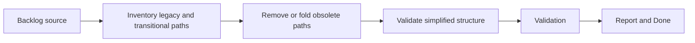

## task_019_remove_legacy_paths_and_align_the_repository_to_architecture_layers - Remove legacy paths and align the repository to architecture layers
> From version: 3.0.0
> Status: Done
> Understanding: 100%
> Confidence: 97%
> Progress: 100%
> Complexity: Medium
> Theme: Architecture
> Reminder: Update status/understanding/confidence/progress and dependencies/references when you edit this doc.

# Context
- Derived from backlog item `item_013_remove_legacy_paths_and_align_the_repository_to_architecture_layers`.
- Source file: `logics/backlog/item_013_remove_legacy_paths_and_align_the_repository_to_architecture_layers.md`.
- Related request(s): `req_014_remove_legacy_paths_and_align_the_repository_to_architecture_layers`.

# Plan
- [x] 1. Inventory redundant legacy paths, transitional wrappers, and layer violations left behind by the incremental migration.
- [x] 2. Remove or fold the obsolete paths into the adopted architecture while preserving current behavior.
- [x] 3. Validate the simplified structure with local checks, update imports or references as needed, and record the cleanup in `logics`.
- [x] FINAL: Update related Logics docs

# AC Traceability
- AC1 -> Step 1 and Step 2. Proof: obsolete paths removed or folded into the target structure.
- AC2 -> Step 2 and Step 3. Proof: preserved behavior and local validation.
- AC3 -> FINAL. Proof: updated `logics` docs and regular commits.

# Links
- Backlog item: `item_013_remove_legacy_paths_and_align_the_repository_to_architecture_layers`
- Request(s): `req_014_remove_legacy_paths_and_align_the_repository_to_architecture_layers`
- Orchestration task: `task_004_orchestrate_incremental_rewrite_execution_governance_and_validation`

# Validation
- `bash validate.sh`
- `python3 logics/skills/logics-doc-linter/scripts/logics_lint.py`
- `python3 -m unittest discover -s tests -p "test_*.py" -v`
- `node --test tests/test_utils.mjs`
- run any cleanup-specific smoke checks added by this slice

# Definition of Done (DoD)
- [x] Scope implemented and acceptance criteria covered.
- [x] Validation commands executed and results captured.
- [x] Linked request/backlog/task docs updated.
- [x] Status is `Done` and progress is `100%`.

# Report
- Earlier migration slices made the target structure stable enough to remove transitional wrappers safely.
- Cleaned up legacy helper paths in `modules/export.mjs`, `modules/viewer.mjs`, `modules/viewerActions.mjs`, `views/exportView.mjs`, `views/changelogView.mjs`, and `modules.mjs`.
- Removed obsolete `_game`, `_ui`, `Stg`, and `isCfg` wrappers where explicit dependencies or direct module access had already replaced their architectural purpose.
- Validation executed:
- `node --test tests/test_*.mjs`
- `python3 -m unittest discover -s tests -p "test_*.py" -v`
- `bash validate.sh`
- `python3 logics/skills/logics-doc-linter/scripts/logics_lint.py`
- `python3 logics/skills/logics-flow-manager/scripts/workflow_audit.py`
